# CLI 동작 시험 · Figma 목업과 실제 Claude Code 비교 (2026-10-09)

> **무엇인가요:** Figma 목업(Akasha MVP)의 "확인 대기" 흐름이 실제 대화형 claude CLI에서 그대로 되는지 본 시험이에요. 목업 장면 7개를 실제 CLI에서 키 입력으로 재현하고, 목업과 나란히 놓고 비교했어요.
>
> **이름:** 10/9에 찍어서 화면에는 바꾸기 전 이름 **akasha**로 나와요. 10/10에 HARIBO로 바꿨어요.
>
> **대역을 썼어요:** MCP 서버는 목업 장면을 만들려고 만든 시험용 대역이에요(결정·작업·확인 대기를 파일에 저장). haribo 저장소 코드, 팀 DB(Supabase), 실제 Figma는 쓰지 않았어요. 실제 서버 코드로 돌린 화면은 [실행 화면](실행-화면.md)에 있어요.
>
> **결과:** 목업의 흐름(카드 → 선택 창 → 기록 → 다음 확인 대기)은 실제 CLI에서도 그대로 됐어요. 다만 CLI가 정하는 모양(첫 화면, 답 기록 줄, 도구 호출 접힘, 배지 색)은 목업과 달라요. 정리는 [한눈에 보기](#한눈에-보기)와 [목업에 가까워지려면](#목업에-가까워지려면)에 있어요.

## 시험 환경

| 항목        | 값                                                                                               |
| ----------- | ------------------------------------------------------------------------------------------------ |
| Claude Code | 2.1.283, 모델 Opus 5.5, 대화형 모드                                                              |
| 터미널      | Windows 의사 터미널(ConPTY) 140×60. 화면을 그대로 그려 찍었어요 (글꼴만 시험 도구 쪽 글꼴)       |
| MCP 서버    | 시험용 대역. 도구 5개: `list_pending`, `respond`, `update_task`, `save_decision`, `get_decision` |
| 훅·상태 줄  | SessionStart 훅(제약 조건과 확인 대기를 작업 맥락에 넣음), 상태 줄 "akasha 연결됨 · …"           |
| Figma       | 대역. 수정 요청만 기록하고 실제 파일은 바꾸지 않아요                                             |
| 격리        | 개인 설정(전역 훅·플러그인)과 claude.ai 커넥터는 빼고 작업 폴더 설정만 읽게 했어요. 자동 기억 끔 |

**장면과 사람**

| 작업 폴더    | 사람           | 작업               | 하는 일                                                              |
| ------------ | -------------- | ------------------ | -------------------------------------------------------------------- |
| order-design | 민호(디자이너) | T-22               | 제약 조건 확인 대기를 거절하고, 대화에서 배송 상태 2단계를 정해 저장 |
| order-api    | 서준(백엔드)   | T-21, T-31         | 확인 대기 3건(민호가 저장한 v2 포함)을 처리하고 작업을 이어서 함     |
| order-qa     | 하린(QA)       | T-30 (완료된 작업) | 확인 대기 때문에 완료된 작업을 다시 열고, 테스트 케이스를 고침       |

순서는 order-design → order-api → order-qa예요. 앞 장면에서 저장한 결정이 다음 장면의 확인 대기가 돼요.

## 한눈에 보기

✅ 같음 · 🔶 다름 · ❌ 안 됨

| 목업의 동작                                            | 결과 | 실제 CLI에서 본 것                                                                                                                                       |
| ------------------------------------------------------ | ---- | -------------------------------------------------------------------------------------------------------------------------------------------------------- |
| `claude`만 치면 Claude가 먼저 "확인할 변경이 1개"      | ❌   | 대화형 CLI는 사용자가 먼저 입력해야 답해요. 훅의 `initialUserMessage`도 대화형에서는 무시됐어요. 첫 메시지를 보내면 그 일보다 확인 대기를 먼저 보여 줘요 |
| 세션 시작 한 줄 "MCP 서버 akasha 연결됨 · …"           | 🔶   | 앞에 `SessionStart:startup says:`가 붙고, 초록 글자가 아니라 회색 ⎿ 줄로 나와요                                                                          |
| 확인 카드: 배지, 제목, 정한 사람·시각·버전, 값 표      | 🔶   | 글과 표는 그대로 나와요(선 있는 표). 배지는 색 칩이 아니라 파란 글자이고, 카드 테두리는 없어요                                                           |
| "이 변경이 내 작업에 영향을 주나요?" 선택 창           | ✅   | ❯ 커서, 번호, 머리표 칩(확인 대기 1/3)까지 같아요. 선택지마다 설명 줄이 붙고, "Type something." "Chat about this"가 자동으로 붙어요                      |
| 고른 답이 "❯ 2. 영향 없음 (거절)"로 남음               | 🔶   | "User answered Claude's questions: · 질문 → 영향 없음 (거절)"로 남아요. 영어 고정 문구예요                                                               |
| 거절하면 이유를 묻고 기록                              | ✅   | Claude가 그 문장으로 묻고, 입력한 이유가 `respond`의 `reason`에 그대로 들어가요                                                                          |
| "● akasha.respond T-22 · … · 거절" 아래에 결과         | 🔶   | 기본 화면에서는 "Called akasha" 한 줄로 접혀요. Ctrl+O를 누르면 호출과 결과가 보여요. 서버가 이 표시를 바꿀 방법은 없어요                                |
| "확인에 쓴 시간 1분 40초 · 이 결정 버전의 처리 2/4"    | ✅   | 서버가 계산해 결과 문장으로 돌려줘요. 시간은 선택 창이 뜬 때부터 답을 기록한 때까지예요                                                                  |
| 대화에서 정한 배송 상태 2단계 → Figma 수정 → 결정 기록 | ✅   | Claude가 figma 도구로 프레임을 고치고, 시키지 않아도 `save_decision`으로 v2를 저장했어요. 그 결과가 다음 세션의 확인 대기가 됐어요                       |
| 수락하면 "이 변경을 미리 알고 있었나요?"               | ✅   | 두 번째 선택 창으로 떠요. 설명 문구도 목업 그대로예요                                                                                                    |
| 완료된 작업이면 "다시 열까요?" → 완료 → 진행 중        | ✅   | 선택 창으로 묻고, `respond` 다음에 `update_task`로 상태를 바꿔요. "T-30 · 완료 → 진행 중", "처리 3/4"까지 같아요                                         |
| 다시 연 작업을 고치고 "다시 완료로 바꿀까요?"          | ✅   | 테스트 케이스 파일을 새 기준으로 고친 뒤 그 문장으로 물었어요. 파일 수정은 접히지 않고 바뀐 줄이 색으로 보여요                                           |
| 두 번째 이후 카드도 첫 카드와 같은 모양                | 🔶   | 확인 대기가 2개 이상인 두 장면 모두 첫 카드만 표로 보여 주고, 다음 건부터는 한두 문장으로 줄였어요                                                       |
| "✓ (2/3) … → 영향 있음 (수락) · 이미 알고 있었음"      | 🔶   | 이런 한 줄 요약은 CLI가 만들지 않아요. "User answered" 두 줄과 "Called akasha"가 쌓여요                                                                  |
| 상태 줄 "akasha 연결됨 · order-app · 확인 대기 1"      | ✅   | 그대로 나오고, 답할 때마다 숫자가 줄어요. 그 아래에 권한 모드 줄이 하나 더 있어요                                                                        |
| 입력창 "> 메시지를 입력하세요"                         | 🔶   | 입력창 안내 문구는 바꿀 수 없어요. 처음엔 "Try …" 예시가, 대화 중에는 다음 입력 제안이 흐리게 떠요                                                       |

---

## 1. 세션 시작과 첫 확인 카드 (민호 · T-22)

목업은 `claude`를 켜자마자 카드와 선택지가 떠요. 실제로는 첫 메시지 "주문 내역 화면 작업 시작할게."를 보낸 뒤에 떠요.

**Figma 목업**

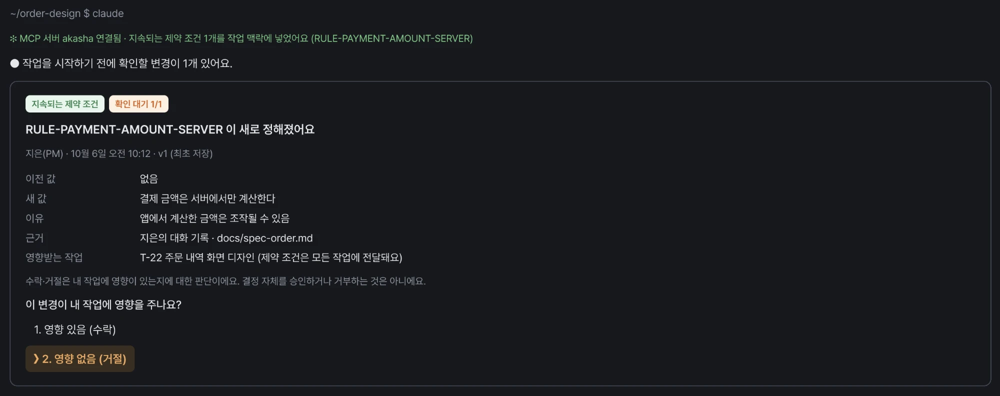

**실제 CLI**

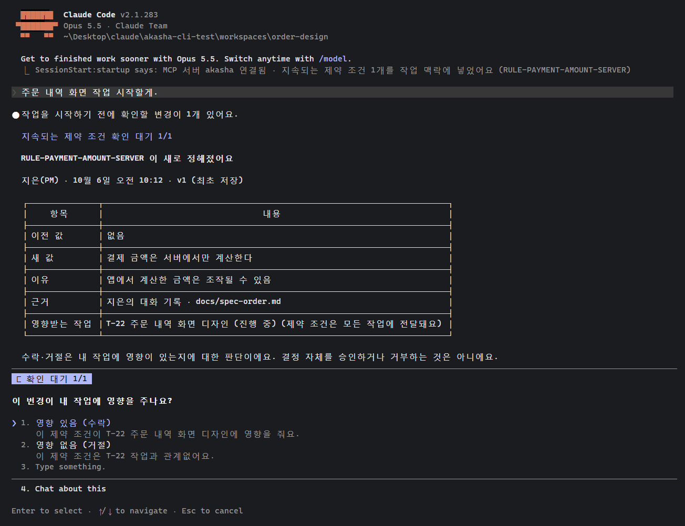

- ❌ `claude`만 켜고 기다리면 아무 일도 없어요. 첫 메시지를 보내야 그 일보다 확인 대기를 먼저 보여 줘요.
- 🔶 세션 시작 한 줄 앞에 `SessionStart:startup says:`가 붙고 회색 ⎿ 줄로 나와요.
- 🔶 배지 "지속되는 제약 조건" "확인 대기 1/1"은 색 칩이 아니라 파란 글자예요. 카드 테두리는 없어요.
- ✅ 제목, 정한 사람·시각·버전, 이전 값·새 값·이유·근거·영향받는 작업 표, 안내 문장이 그대로 나와요.
- ✅ 선택 창의 ❯ 커서, 번호, 머리표 칩 "확인 대기 1/1", 질문 문장이 같아요.
- 🔶 선택지마다 설명 줄이 붙어요(AskUserQuestion은 설명이 필수예요). "3. Type something." "4. Chat about this"는 CLI가 늘 붙여요.

## 2. 거절 이유 기록과 대화 중 결정 (민호 · T-22)

**Figma 목업**

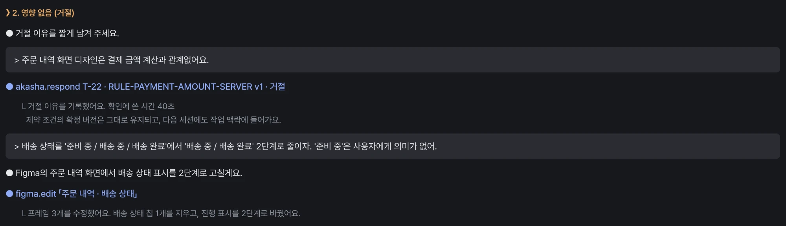

**실제 CLI · 기본 화면**

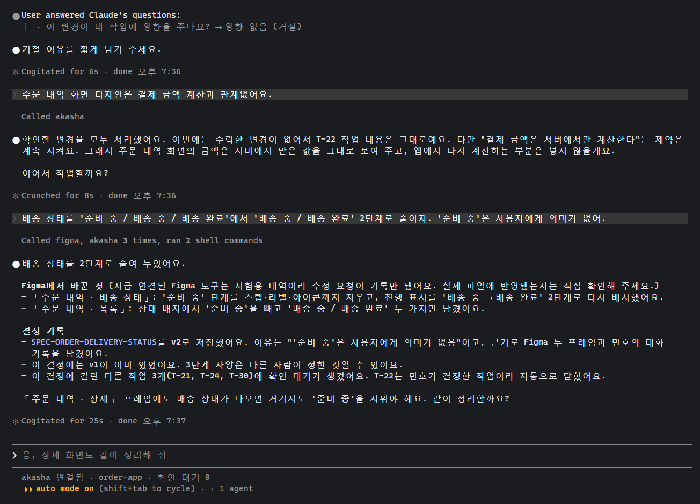

Ctrl+O로 펼친 기록 두 장 (respond, figma 수정과 결정 저장)

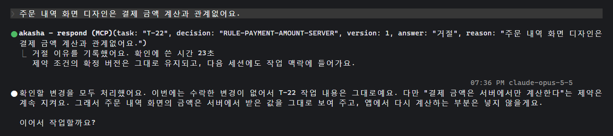

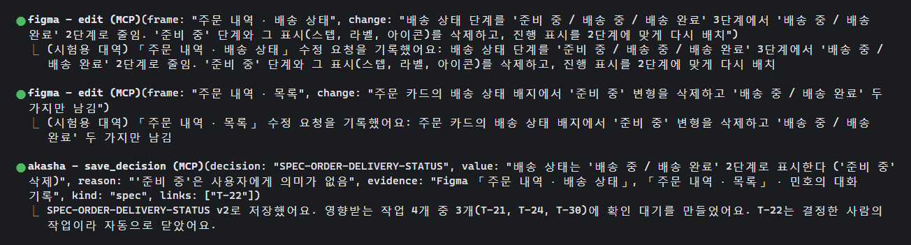

- 🔶 고른 답은 "❯ 2. 영향 없음 (거절)" 대신 "User answered Claude's questions: · 질문 → 영향 없음 (거절)"로 남아요.
- ✅ Claude가 "거절 이유를 짧게 남겨 주세요."라고 묻고, 입력한 문장이 `respond`의 `reason`에 그대로 들어가요.
- 🔶 기본 화면에서 MCP 호출은 "Called akasha" 한 줄로 접혀요. 목업의 "akasha.respond T-22 · … · 거절" 같은 요약 줄은 서버가 정할 수 없어요.
- ✅ 결과 문장 "거절 이유를 기록했어요. 확인에 쓴 시간 23초"와 제약 조건 안내 문장은 서버가 돌려준 그대로 보여요.
- ✅ 배송 상태 2단계 요청에 Claude가 figma 도구로 프레임을 고치고, 시키지 않아도 `save_decision`으로 SPEC-ORDER-DELIVERY-STATUS v2를 저장했어요. T-21·T-24·T-30에 확인 대기가 생기고, T-22는 결정한 사람의 작업이라 자동으로 닫혔어요.
- 🔶 Claude가 작업 폴더를 먼저 살펴보느라 셸 명령 2개를 더 돌렸어요.

## 3. 확인 대기 3개 중 첫 번째 (서준 · T-21)

첫 메시지 "T-21 주문 API 작업 이어서 할게." 뒤의 화면이에요. 카드 내용은 앞 장면에서 민호님 세션이 저장한 v2예요.

**Figma 목업**

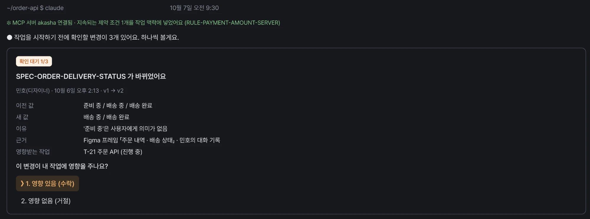

**실제 CLI**

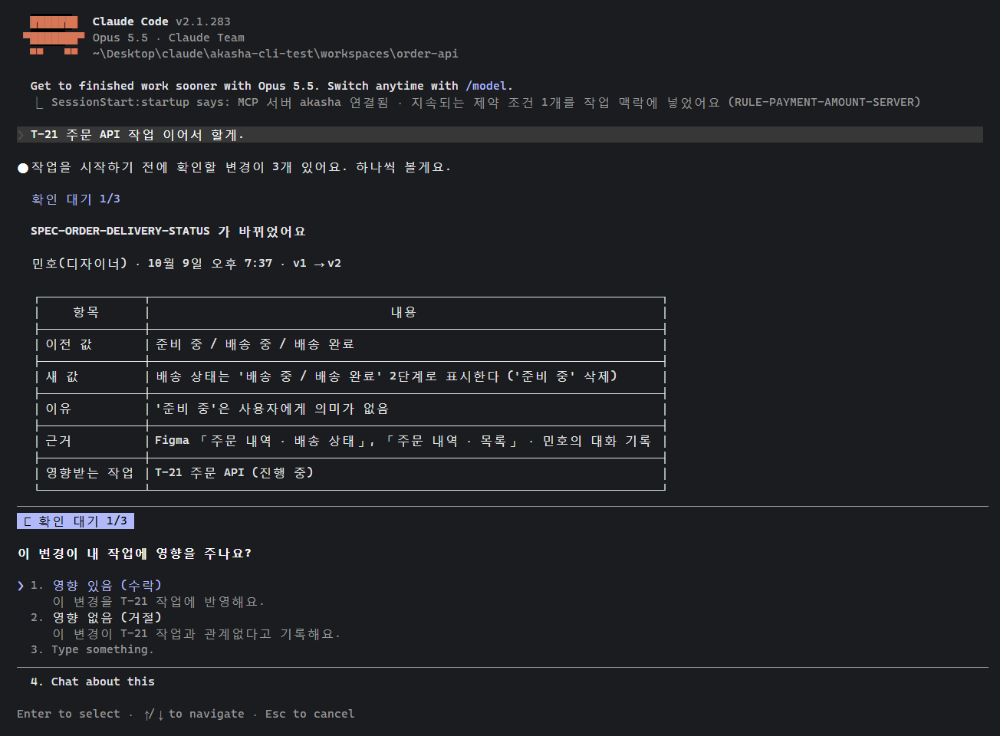

- ✅ "작업을 시작하기 전에 확인할 변경이 3개 있어요. 하나씩 볼게요."로 시작해요.
- ✅ 제목, 정한 사람(민호), v1 → v2, 이전 값·새 값·이유·근거·영향받는 작업이 목업과 같은 순서로 나와요.
- 🔶 시각은 실제로 저장한 때(10월 9일 오후 7:37)예요. 새 값 문장은 Claude가 대화에서 정리해 저장한 문장이라 목업과 조금 달라요.
- 🔶 배지와 선택지 모양의 차이는 1절과 같아요.

## 4. 수락 뒤 "이 변경을 미리 알고 있었나요?" (서준 · T-21)

"영향 있음 (수락)"을 고르자 바로 두 번째 선택 창이 떠요.

**Figma 목업**

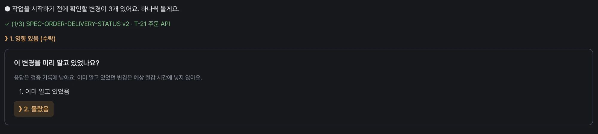

**실제 CLI**

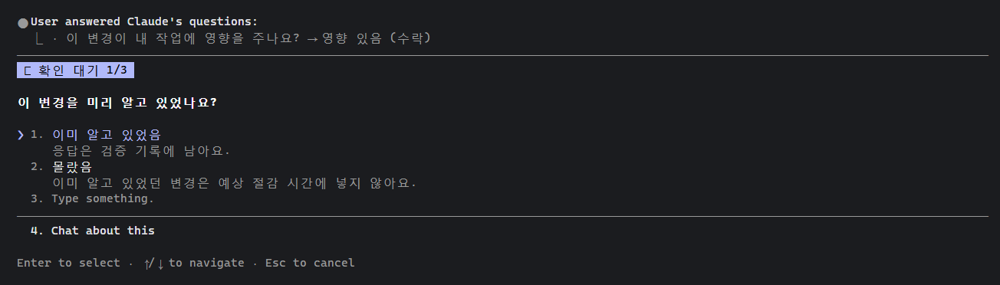

- ✅ 질문 문장, 선택지 "이미 알고 있었음" / "몰랐음", 설명 문구가 목업과 같아요.
- 🔶 목업은 "✓ (1/3) SPEC-ORDER-DELIVERY-STATUS v2 · T-21 주문 API"처럼 한 줄로 접지만, 실제로는 "User answered Claude's questions" 줄이 쌓여요.

## 5. 나머지 2건 처리, 이어서 작업 (서준 · T-21)

**Figma 목업**

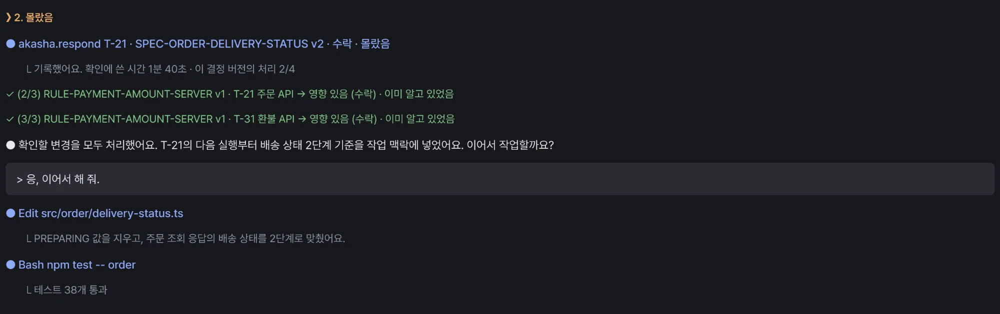

**실제 CLI · 기본 화면**

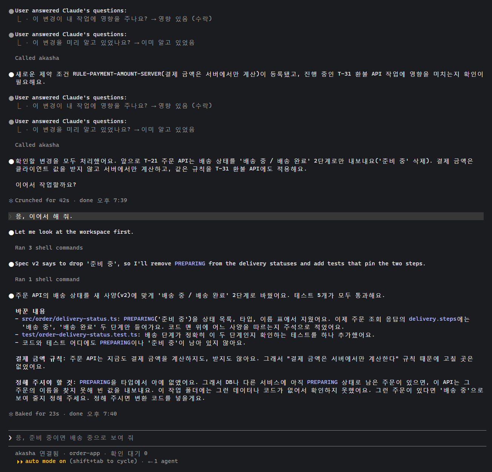

Ctrl+O로 펼친 테스트 실행 결과

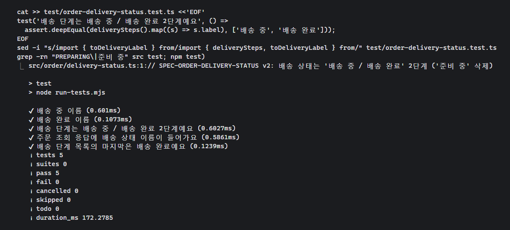

- ✅ `respond` 결과가 "기록했어요. 확인에 쓴 시간 25초 · 이 결정 버전의 처리 2/4"로 와요. 2/4는 목업과 같은 숫자예요(T-22 자동 닫힘 + T-21).
- 🔶 2·3번째 건(지속되는 제약 조건)은 표 카드 대신 한 문장으로 줄여 보여 줬어요. 같은 안내를 받아도 Claude가 카드를 줄일 수 있어요.
- ✅ "확인할 변경을 모두 처리했어요. … 이어서 작업할까요?"로 멈추고, "응, 이어서 해 줘." 뒤에 코드를 2단계로 고치고 테스트 5개를 통과시켰어요.
- 🔶 Claude가 Edit 도구 대신 셸(heredoc)로 파일을 써서 "Ran 1 shell command"로만 보여요. 중간 안내 두 줄은 영어로 나왔어요.

## 6. 완료된 작업의 확인 대기와 다시 열기 (하린 · T-30)

**Figma 목업**

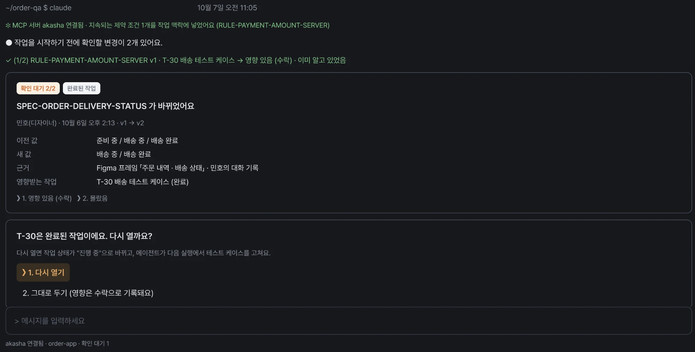

**실제 CLI · 켠 직후의 상태 줄과 입력창**

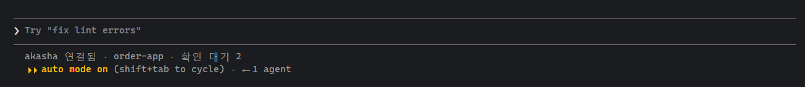

**실제 CLI · 두 번째 건(SPEC v2)에서 "다시 열까요?"**

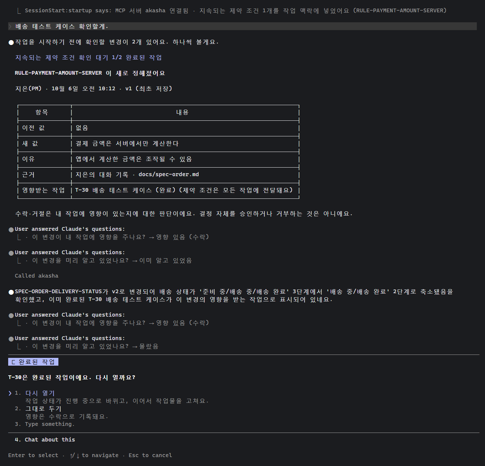

- ✅ 상태 줄이 "akasha 연결됨 · order-app · 확인 대기 2"로 나와요. 목업과 같은 자리, 같은 문장이에요.
- ✅ 첫 건(RULE, 1/2)은 배지에 "완료된 작업"까지 붙은 카드로 보여 주고, 다시 열지는 묻지 않아요.
- 🔶 두 번째 건(SPEC v2)은 표 카드 대신 한 문장으로 줄여 보여 줬어요. 목업은 "확인 대기 2/2 · 완료된 작업" 카드를 보여 줘요.
- ✅ 수락 → 몰랐음 다음에 "T-30은 완료된 작업이에요. 다시 열까요?" 창이 떠요. 선택지 "다시 열기" / "그대로 두기"와 설명이 같고, 머리표 칩은 "완료된 작업"이에요.
- 🔶 목업은 고른 답을 한 줄로 접지만, 실제로는 답마다 "User answered" 두 줄이 쌓여요.

## 7. 다시 열고 고친 뒤 "다시 완료로 바꿀까요?" (하린 · T-30)

**Figma 목업**

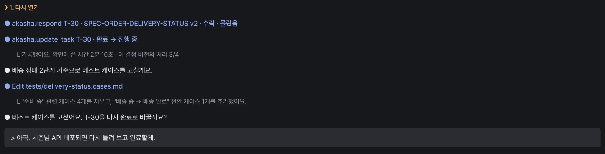

**실제 CLI · 기본 화면**

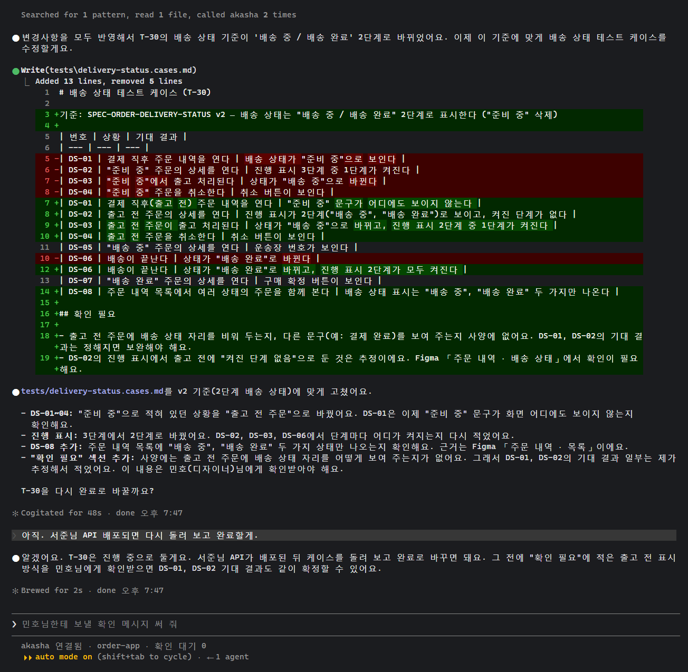

Ctrl+O로 펼친 respond와 update_task 호출

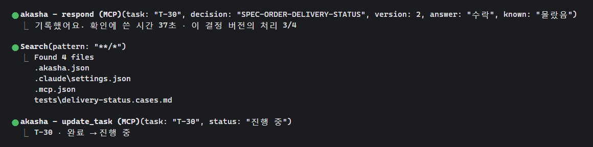

- ✅ `respond` 결과 "기록했어요. 확인에 쓴 시간 37초 · 이 결정 버전의 처리 3/4", `update_task` 결과 "T-30 · 완료 → 진행 중"이 서버가 돌려준 그대로예요. 3/4는 목업과 같은 숫자예요.
- ✅ "…테스트 케이스를 수정할게요." 뒤에 바로 파일을 고치고("준비 중" 케이스 4개와 DS-06을 새 기준으로 고치고 DS-08을 추가), "T-30을 다시 완료로 바꿀까요?"로 물었어요. "아직…"이라고 답하자 진행 중으로 두었어요.
- 🔶 기본 화면에서 akasha 호출은 "Searched for 1 pattern, read 1 file, called akasha 2 times" 한 줄로 접혀요. 파일 수정(Write)은 접히지 않고 바뀐 줄이 빨강·초록으로 보여요.
- ✅ Claude가 사양에 없는 부분(출고 전 주문의 표시)을 "확인 필요"로 따로 적고 민호님 확인을 권했어요. 목업에는 없지만 흐름에 맞는 행동이에요.

## 목업에 가까워지려면

- **첫 화면:** CLI는 먼저 말을 걸 수 없어요. 훅 메시지를 "확인할 변경 1개 · 아무 메시지나 보내면 먼저 보여 드려요"처럼 바꾸거나, 팀 안내에 `claude "작업 시작"`처럼 첫 메시지를 붙여 켜는 방법을 적어 두면 돼요.
- **카드 모양 고정:** 서버가 카드 글(마크다운)을 만들어 `list_pending`이나 `respond` 결과에 담아 주고, Claude는 그 글을 그대로 옮기게 해요. 그러면 두 번째 이후 카드가 줄어드는 문제가 줄어요.
- **목업 고치기:** CLI가 정하는 부분은 목업을 실제 모양으로 바꾸는 게 맞아요. `SessionStart:startup says:` 접두어, "User answered Claude's questions", "Called akasha" 접힘, "Type something."·"Chat about this" 선택지, 입력창 제안이 여기에 해당해요.
- **배지 색:** 마크다운으로는 색 칩을 만들 수 없어요. 색이 꼭 필요하면 상태 줄(ANSI 색 가능)이나 선택 창 머리표(칩으로 보임)에 넣어요.
- **안내문은 빈틈 없이:**
  - 1차: "완료된 작업이면 다시 열기"를 사양 변경에만 적용한다고 쓰지 않았더니, Claude가 제약 조건 건에서도 다시 열지 물었어요.
  - 2차: "모두 끝나면 이어서 할지 묻기" 규칙이 다시 연 작업에도 적용돼 바로 고치지 않았어요.
  - 둘 다 고친 3차에서 목업과 같아졌어요.
- **파일은 Edit 도구로:** 한 장면에서 Claude가 셸로 파일을 써서 수정 내용이 "Ran 1 shell command"로만 보였어요. 팀 CLAUDE.md에 "파일은 Edit 도구로 고쳐요"를 넣으면 목업처럼 "Edit 파일" 줄이 보여요.

## 시험 방법과 한계

- 실제 대화형 claude를 Windows 의사 터미널에 띄우고, 화면을 읽어 목업과 같은 선택을 키 입력으로 했어요. 스크린샷은 그 터미널 화면을 그대로 그린 거예요.
- 같은 안내로 다시 돌려도 Claude의 문장은 조금씩 달라져요. 이 문서는 마지막 전체 실행(order-design → order-api)과 order-qa 3차 결과예요. 그 전 실행은 화면 색이 빠지거나 자동 입력 스크립트가 질문을 잘못 읽어서 다시 돌렸어요.
- 시간 표시(10월 9일 오후 7:37, 확인에 쓴 시간 21~37초)는 실제 시험 시각과 자동 입력 속도라 목업 숫자와 달라요.
- 시험용 서버와 자동 진행 도구는 로컬 시험 폴더에만 있고, 이 저장소에는 올리지 않았어요.
