# 기능 테스트 보고서 (2026-10-10)

> **무엇을 했나요:** 이 저장소의 기능을 하나씩 실제로 실행하고, 결과를 스크린샷으로 남겼어요. 대상은 개발 환경, 자동 검사, DB 규칙, MCP 서버, 명령어, 실제 Claude Code 세션, 웹 앱(PWA)이에요.
>
> **기준 코드:** 10/10 작업까지 반영한 haribo 저장소예요 (D48 빌드 없이 실행, D49 `apps/` 구조, D50 웹 + PWA). 이 코드는 아직 팀 저장소에 올리기 전이에요.
>
> **결과:** 확인한 기능은 모두 기대대로 동작했어요. 실제 Supabase와 배포 주소는 아직 없어서, 그 둘을 대신한 부분은 [7절](#7-이번에-확인하지-못한-것)에 따로 적었어요.

## 시험 환경

| 항목                | 값                                                                                |
| ------------------- | --------------------------------------------------------------------------------- |
| 운영체제            | Windows 11 Pro                                                                    |
| Node / pnpm         | 24.18.0 (`.nvmrc`로 고정) / 11.25.0                                               |
| TypeScript          | 6.0.3                                                                             |
| DB                  | 이 PC의 임시 PostgreSQL 18.6 (Supabase 대신, 마이그레이션 4개를 그대로 올림)      |
| Claude Code         | 2.1.295, 모델 `claude-opus-5-5`, `claude -p`로 실행                               |
| 브라우저            | Microsoft Edge 155 (화면 없이 실행하고 DevTools Protocol로 조작·촬영)             |
| 팀 위키·샘플 데이터 | 팀 저장소 AX-PJ3/HARIBO의 `team-wiki/`(기준 90개), `samples/data/issue-links.csv` |

**스크린샷을 읽는 법**

- 웹 앱 화면(6절)은 Edge에서 실제로 찍은 화면이에요.
- 명령어와 Claude Code 화면은 실행한 출력을 그대로 터미널 모양으로 그려서 찍었어요.
  - 긴 출력은 가운데를 줄이고 "… N줄 줄임"으로 표시했어요.
  - 긴 임시 폴더 경로는 `HARIBO/`, `haribo`로 줄여 적었어요.
- 키와 토큰은 어느 화면에도 나오지 않아요.

## 결과 요약

| #   | 기능                                            | 결과 | 근거                                  |
| --- | ----------------------------------------------- | ---- | ------------------------------------- |
| 1   | 개발 환경 점검 (Node 24.18 고정)                | ✅   | [1-1](#1-1-개발-환경-점검)            |
| 2   | 타입·린트·포맷 검사                             | ✅   | [1-2](#1-2-타입린트포맷-검사)         |
| 3   | 단위 테스트 75개                                | ✅   | [1-3](#1-3-단위-테스트)               |
| 4   | DB 규칙 SQL 검사 156개                          | ✅   | [2](#2-db-규칙-sql-검사)              |
| 5   | MCP 서버 (토큰 없으면 401, 도구 6개, ping)      | ✅   | [3](#3-mcp-서버)                      |
| 6   | 팀 위키 불러오기, 적용 범위 경로 확인           | ✅   | [4](#4-명령어)                        |
| 7   | 세션 시작 때 항상 적용 기준 전달                | ✅   | [5-1](#5-1-세션-시작-때-받은-안내)    |
| 8   | 목록·검색·읽기                                  | ✅   | [5-2](#5-2-목록검색읽기)              |
| 9   | v2 저장, 빈 칸 거절, v1로 되돌리기              | ✅   | [5-3 ~ 5-6](#5-3-v1-읽고-v2-저장)     |
| 10  | 웹 앱 화면, 메뉴 이동                           | ✅   | [6-1](#6-1-첫-화면과-메뉴)            |
| 11  | PWA 설치 가능 (서비스 워커, 매니페스트, 아이콘) | ✅   | [6-2](#6-2-pwa-설치-가능-검사)        |
| 12  | 서버가 꺼져도 앱 껍데기 열기                    | ✅   | [6-3](#6-3-서버가-꺼졌을-때-오프라인) |
| 13  | 화면이 공용 키로 DB에 바로 붙기, 실패 표시      | ✅   | [6-4, 6-5](#6-4-db에-붙었을-때)       |

---

## 1. 개발 환경과 자동 검사

### 1-1. 개발 환경 점검

`pnpm onboard`는 처음 받은 사람이 실행할 준비가 됐는지 확인해요. Node가 24.18이 아니면 실패로 알려요. 경고 두 개(팀 MCP 서버 주소, 등록)는 아직 팀 서버를 올리지 않아서 나오는 것이에요.

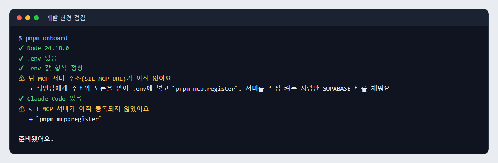

### 1-2. 타입·린트·포맷 검사

패키지 5개(core, cli, detect, mcp-server, web)가 모두 타입 검사를 통과했어요. 웹 앱은 화면용과 빌드 설정용 두 번 검사해요. 린트 오류는 없고 포맷도 모두 맞아요.

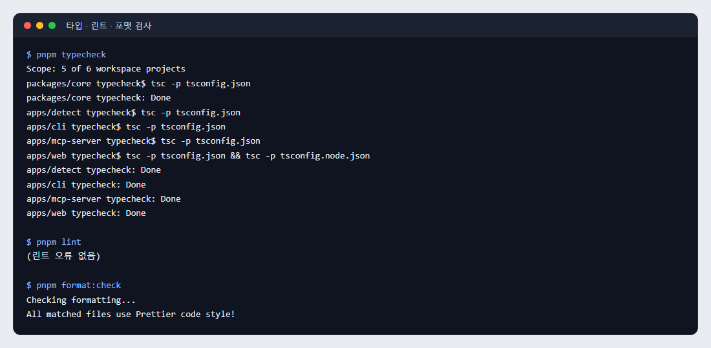

### 1-3. 단위 테스트

10개 파일, 75개가 통과했어요. 파일마다 테스트 이름을 두 개씩 보여 주고 나머지는 개수만 적었어요.

- DB 읽기·쓰기: `data/standards.test.ts` 13개, `data/client.test.ts` 3개
- MCP 서버 HTTP: 19개
- 타입 명세 문서와 코드가 어긋나지 않는지: `spec-doc.test.ts` 2개

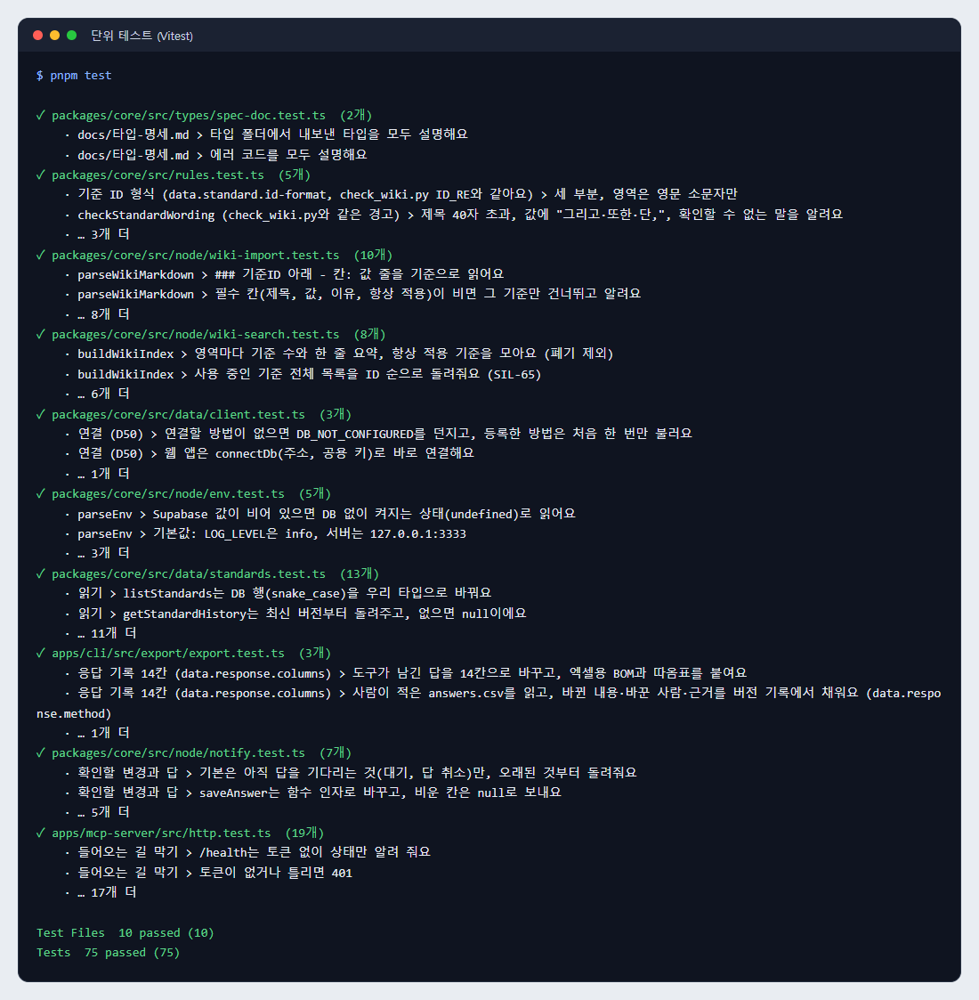

## 2. DB 규칙 (SQL 검사)

임시 PostgreSQL에 빈 DB를 만들고 마이그레이션 4개를 차례로 올린 뒤, `supabase/tests/`의 검사 4개를 돌렸어요. 전부 ROLLBACK이라 데이터는 남지 않아요.

| 검사 파일                        | 개수 | 확인하는 것                                                      |
| -------------------------------- | ---- | ---------------------------------------------------------------- |
| `wiki.test.sql`                  | 41   | 필수 칸, 버전 충돌, 지우기·고치기 금지, 되돌리기, 항상 적용 10개 |
| `v2.test.sql`                    | 49   | 데이터 항목 목록 v2 표, 이슈 저장, 데모 순서                     |
| `compat.test.sql`                | 51   | 팀 위키 호환, 충돌 보류, 답 저장·취소, AI 안전 규칙              |
| `always_on_per_version.test.sql` | 15   | 항상 적용을 버전마다 남기고 되돌리기                             |

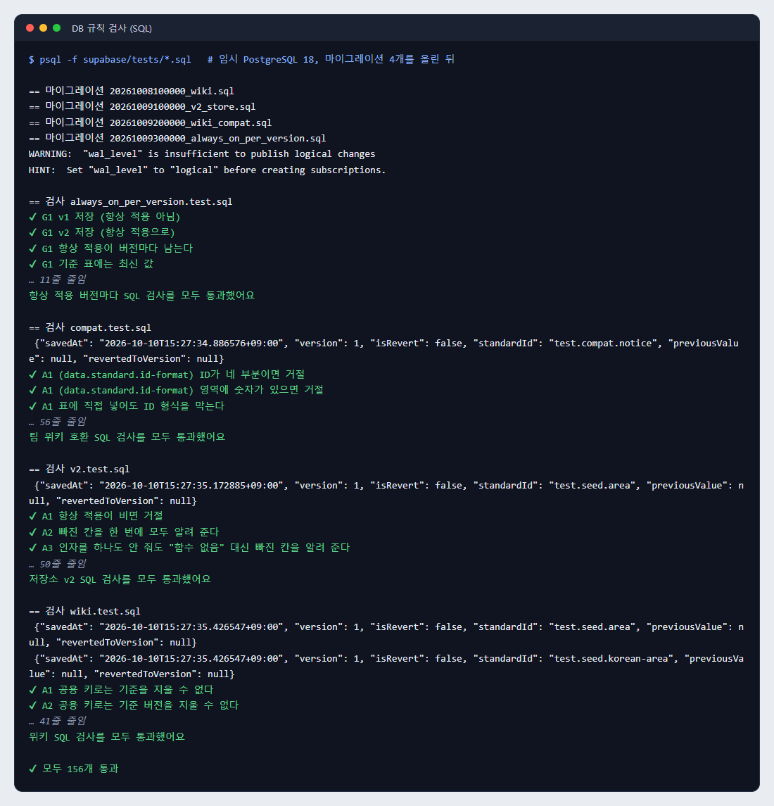

## 3. MCP 서버

`pnpm mcp:check`는 서버를 HTTP로 켜고 Claude Code 없이 붙어 봐요. 토큰 없는 요청은 401로 거절되고, 도구 6개(ping과 위키 도구 5개)가 보이고, ping에 답해요. DB 연결은 5절에서 따로 확인했어요.

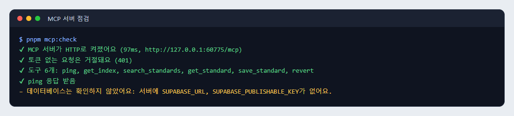

## 4. 명령어

### 4-1. 팀 위키 불러오기 (미리 보기)

`sil import`는 팀 위키 파일 8개에서 기준 90개, 이슈 CSV에서 이슈 14개를 읽었어요. 기준 ID와 개수는 코드에 고정되어 있지 않아요 (SIL-65 조건 2).

경고는 샘플 데이터 문제예요.

- v2에 없는 '할 일' 상태가 있어요.
- SIL-34, SIL-42가 위키에 없는 기준(`notify.answer.skip-limit`)에 연결돼 있어요.

호윤님의 샘플 v2에서 고쳐질 예정이에요.

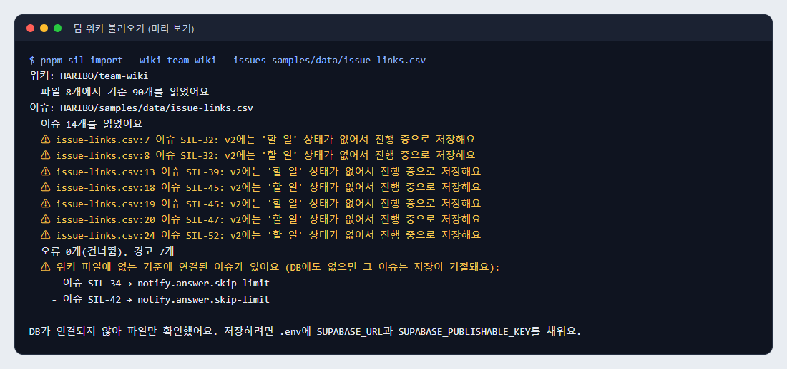

### 4-2. 위키 적용 범위 경로 확인

`sil scope-check`는 위키의 코드 경로가 실제 파일과 맞는지 봐요. 지금은 32개 중 4개만 맞아요.

- **덜 맞는 이유:** 위키가 아직 폴더를 옮기기 전 경로(`packages/mcp/` 등)를 쓰고, 지운 `release.yml`도 가리켜요.
- **도움이 되는 점:** 옛 경로마다 새 폴더(`apps/...`)의 비슷한 파일을 후보로 알려 줘요. 위키 경로를 고칠 때(SIL-62) 그대로 쓰면 돼요.

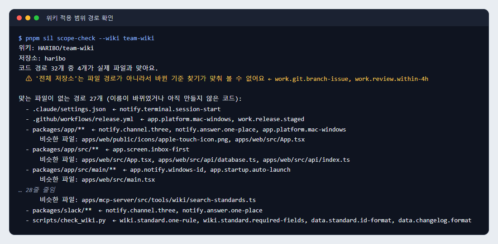

### 4-3. 웹 앱 빌드와 바뀐 기준 찾기

웹 앱 빌드는 2초 안에 끝나요. 바뀐 기준 찾기(`detect`)는 아직 뼈대라 실행되는 것만 확인했어요 (경하님 SIL-66).

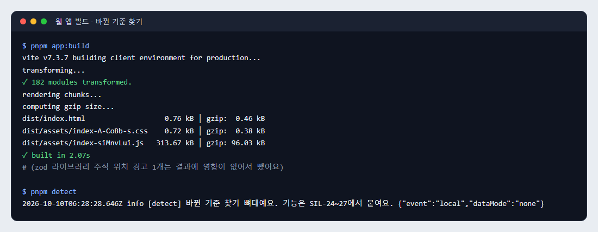

## 5. 실제 Claude Code 세션

**시험 방법**

- MCP 서버는 저장소의 서버 코드(`apps/mcp-server/src/http.ts`)를 Node 24.18로 직접 켰어요 (tsx 없이).
- DB는 임시 PostgreSQL에 팀 위키 90개와 이슈 14개를 넣은 것이에요. 읽기와 함수 호출은 모두 공용 키와 같은 권한(anon)으로 했어요.
- 세션은 `claude -p --strict-mcp-config`로 이 서버 하나만 붙였어요. 사람 이름은 서버 등록 정보(`X-Sil-User`)로 보냈어요(부건, 정민).
- 세션 5개를 돌린 비용은 약 0.32달러였어요.

### 5-1. 세션 시작 때 받은 안내

도구를 하나도 부르지 않았는데, 항상 적용 기준 9개가 세션 시작 안내문으로 그대로 들어왔어요 (SIL-65 조건 8).

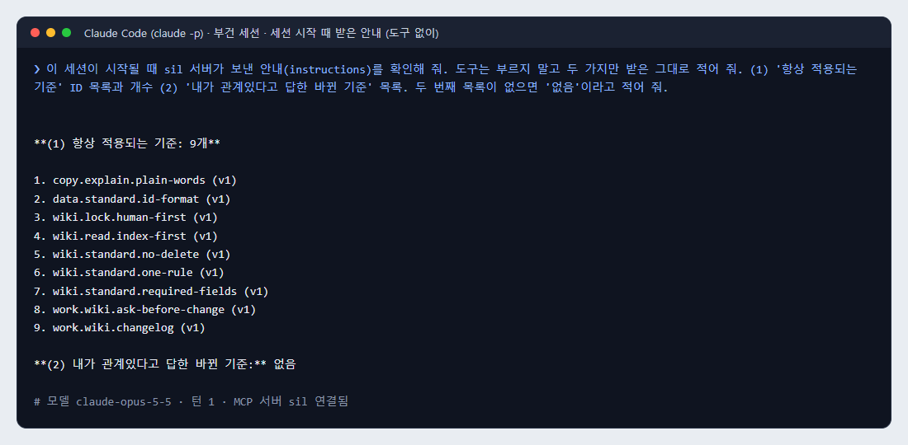

### 5-2. 목록·검색·읽기

`get_index`는 항상 적용 9개와 전체 90개를 돌려줘요. `search_standards`로 '알림 제목'을 찾으면 2건이 나와요. `get_standard`는 최신 v1을 돌려줘요 (SIL-65 조건 4·5).

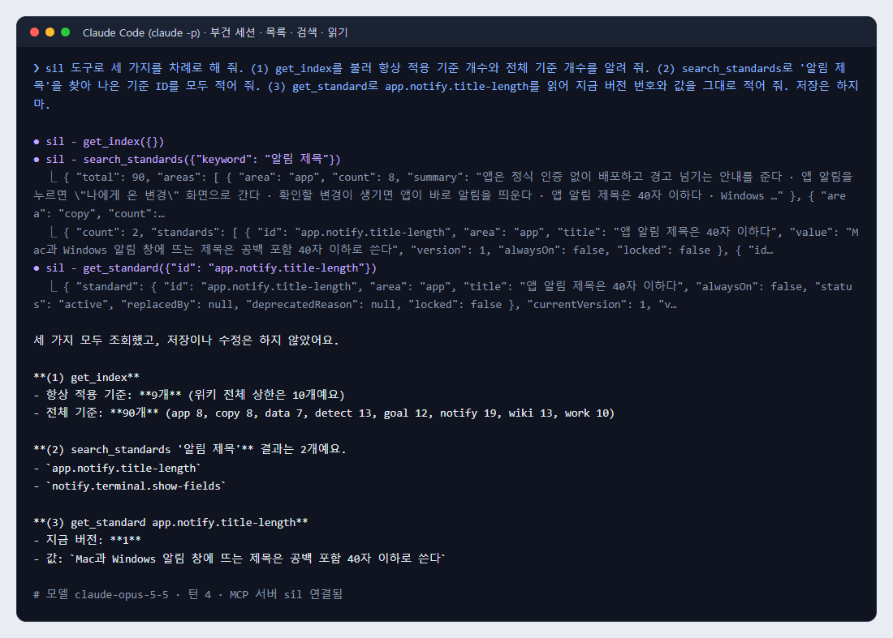

### 5-3. v1 읽고 v2 저장

부건님 세션이 v1을 읽은 뒤 32자 기준을 v2로 저장했어요. 결과에는 CHANGELOG 한 줄이 함께 와요. 근거와 적용 범위는 지금 값을 그대로 유지했어요 (SIL-65 조건 6·10).

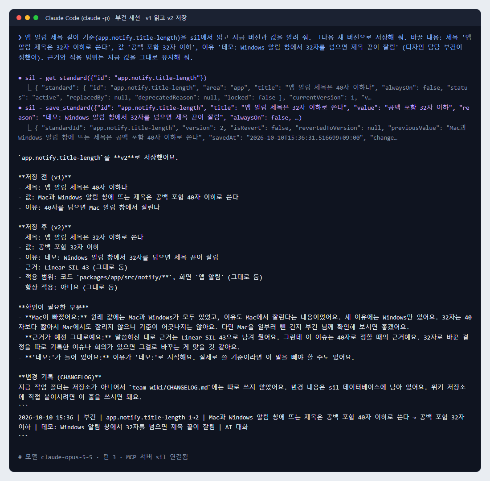

### 5-4. 이유를 비우고 저장하면 거절

이유를 빈 문자열로 저장하게 하자 "이유(reason)이(가) 비어 있어요"로 거절됐고, 새 버전은 생기지 않았어요 (SIL-65 조건 6). 같은 검사는 DB 함수에도 있어요 (2절 `wiki.test.sql`).

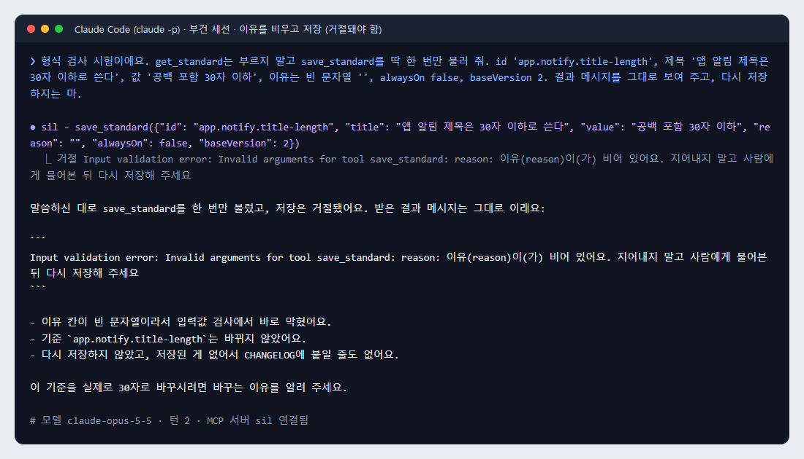

### 5-5. v1로 되돌리기

정민님 세션이 v1로 되돌리자 v1 값을 가진 v3이 새로 생겼어요. "되돌림인가"는 예, 되돌린 버전은 1이에요 (SIL-65 조건 7·10).

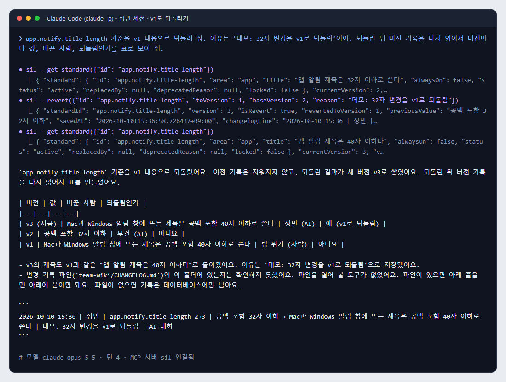

### 5-6. 세션이 끝난 뒤 DB 기록

DB에 v1(팀 위키) → v2(부건) → v3(정민, v1로 되돌림)이 그대로 남았어요. 서버는 저장 함수(`save_standard`, `revert_standard`)를 한 번씩 받았어요.

확인할 변경이 0건인 것은 "새 버전을 알리는 방법"(SIL-65 조건 9)을 아직 민수님과 정하지 않아서예요.

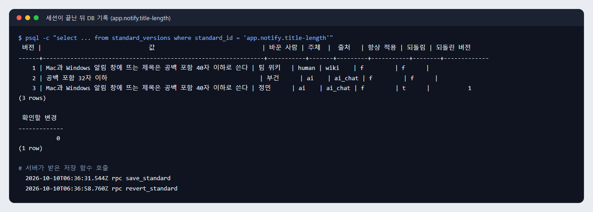

## 6. 웹 앱 (PWA)

`pnpm app:build`로 만든 배포본을 `pnpm app:preview`(http://localhost:4173)로 열고 Edge로 찍었어요.


### 6-1. 첫 화면과 메뉴

Supabase 주소·키가 없으면 예시 데이터로 열리고, 메뉴 아래에 그렇게 알려 줘요. 화면 세 칸은 아직 자리만 있어요 (신지님 SIL-42·44·45).

| 나에게 온 변경 (첫 화면)                        | 위키 (메뉴 이동)                                  |
| ----------------------------------------------- | ------------------------------------------------- |
| 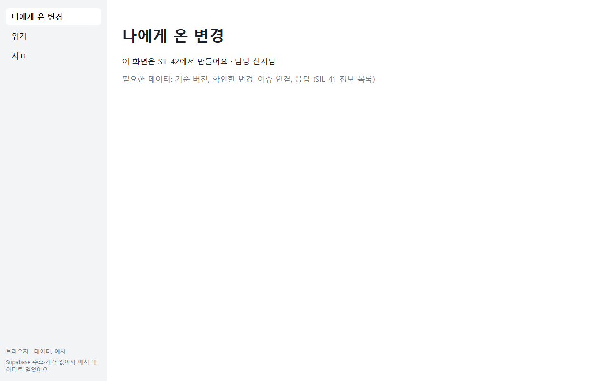 | 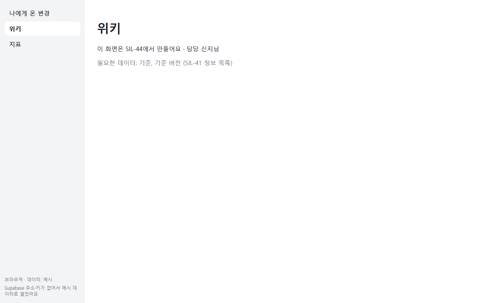 |

### 6-2. PWA 설치 가능 검사

Edge의 DevTools Protocol로 브라우저가 판단한 결과를 그대로 받았어요.

- 서비스 워커가 활성화돼서 이 페이지를 맡고 있어요.
- 매니페스트(이름 HARIBO, 앱 창으로 열기)와 아이콘 3개가 정상이에요.
- 설치를 막는 문제가 0개예요 (SIL-65 조건 11의 "PWA로 설치할 수 있게").

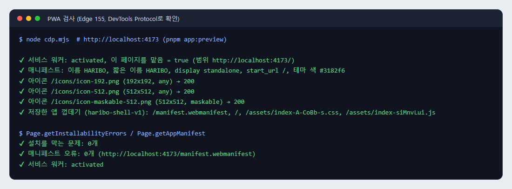

### 6-3. 서버가 꺼졌을 때 (오프라인)

배포본 서버를 끈 뒤 새로 고쳤어요. 서버로 가는 요청은 실패했지만(`Failed to fetch`), 서비스 워커가 저장해 둔 앱 껍데기로 화면이 열렸어요.


### 6-4. DB에 붙었을 때

**왜 시험 서버를 썼나요:** 아직 Supabase 프로젝트가 없어요. 그래서 Supabase(PostgREST)처럼 `standards` 개수만 돌려주는 작은 시험 서버를 띄우고, 그 주소와 시험용 공용 키로 빌드했어요.

화면이 브라우저에서 공용 키를 붙여 DB에 직접 물었고, 메뉴 아래에 "데이터: DB (기준 90개)"가 나왔어요 (D50). 시험 서버도 공용 키가 붙은 요청(`HEAD /rest/v1/standards?select=id`)을 받았어요.


### 6-5. DB에 못 붙었을 때

시험 서버를 끄고 새로 고쳤어요. 처음 1초쯤은 "불러오는 중"이었고, 약 15초 안에 "DB에 연결하지 못했어요"와 확인할 것이 빨간 글씨로 나왔어요. 실패를 빈 목록이나 "변경 없음"으로 숨기지 않아요 (notify.error.not-empty).


## SIL-65 조건별 결과

| #   | 조건                                   | 결과    | 근거                                     |
| --- | -------------------------------------- | ------- | ---------------------------------------- |
| 1   | 표 4개, 버전마다 한 줄·제목            | ✅      | 2절 SQL 검사, 5-6 DB 기록                |
| 2   | team-wiki → DB 명령, ID·개수 고정 없음 | ✅      | 4-1                                      |
| 3   | 예전 필드 저장, 필수 검사는 5개        | ✅      | 2절 SQL 검사, 5-3                        |
| 4   | `get_index` 항상 적용·전체 목록        | ✅      | 5-2                                      |
| 5   | `search_standards`, `get_standard`     | ✅      | 5-2                                      |
| 6   | 필수 칸 검사, 빠진 칸 알림             | ✅      | 5-4                                      |
| 7   | `revert`, 되돌림 = 예                  | ✅      | 5-5, 5-6                                 |
| 8   | 세션 시작 때 항상 적용 전달            | ✅ 로컬 | 5-1                                      |
| 9   | 민수님과 새 버전 알림 방법 정하기      | ⏳      | 사람끼리 정할 일 (확인할 변경 0건, 5-6)  |
| 10  | v1 읽기 → v2 저장 → v1 되돌리기 시연   | ✅ 로컬 | 5-3, 5-5, 5-6                            |
| 11  | 웹 앱 배포 + PWA 설치                  | ◐       | PWA 설치 가능 ✅ (6-2), 배포 주소는 아직 |

"로컬"은 실제 Claude Code와 실제 서버 코드로 돌렸지만, DB가 Supabase가 아니라 이 PC의 임시 PostgreSQL이었다는 뜻이에요.

## 7. 이번에 확인하지 못한 것

- **실제 Supabase:** 프로젝트를 만들기 전이라, supabase-js ↔ PostgREST 실제 호출은 확인하지 못했어요.
  - 5절은 임시 PostgreSQL에 같은 권한(anon)으로 붙였어요.
  - 6-4는 PostgREST처럼 응답하는 시험 서버를 썼어요.
- **배포 주소:** 웹 앱과 MCP 서버를 올릴 곳(호스팅)을 아직 정하지 않았어요. PWA 설치는 HTTPS 주소가 필요해요. 이번 확인은 `localhost`(브라우저가 안전한 주소로 봐요)에서 했어요.
- **대화형 화면:** Claude Code 세션은 `claude -p`(대화형 아님)로 돌렸어요.
- **아직 없는 기능:** 확인할 변경 만들기(조건 9), 터미널 알림(`sil brief`), 앱 알림(Realtime·Web Push), 화면 세 칸은 담당 이슈에서 만들 예정이라 시험 대상이 아니었어요.

## 다시 돌리는 법

```bash
pnpm onboard        # 개발 환경 점검
pnpm check          # 타입, 린트, 포맷, 단위 테스트
pnpm mcp:check      # MCP 서버 (401, 도구 목록, ping)
pnpm sil import     # 팀 위키 불러오기 미리 보기 (저장은 --apply)
pnpm sil scope-check
pnpm app:build && pnpm app:preview   # 웹 앱 배포본 (http://localhost:4173)
```

- **DB 규칙:** `psql "<DB 주소>" -v ON_ERROR_STOP=1 -f supabase/tests/wiki.test.sql`로 돌려요. `v2.test.sql`, `compat.test.sql`, `always_on_per_version.test.sql`도 같은 방법이에요.
- **PWA 확인:** Chrome·Edge의 개발자 도구 → Application 탭에서 Manifest와 Service workers를 봐요. 주소창의 설치 아이콘으로도 확인할 수 있어요.
