# 실행 화면 모음 · 팀 피드백 요청 (2026-10-11)

> **무엇인가요:** haribo의 기능을 실제로 실행하고, 화면을 단계마다 찍어 모았어요. 기능이 기대대로 도는지 팀원이 직접 보고 의견을 주시면 좋겠어요.
>
> **피드백은 이렇게 주세요:** [9절 "피드백 받고 싶은 점"](#9-피드백-받고-싶은-점)에 질문을 모아 두었어요. 번호를 붙여 Linear 댓글이나 PR 리뷰로 답해 주세요. 그 밖에 이상해 보이는 화면은 그림 번호(예: `27-save-v2`)를 같이 적어 주세요.
>
> **결과:** 찍은 기능은 모두 기대대로 동작했어요. 다만 실제 Supabase와 배포 주소는 아직 없어요. 그래서 그 둘을 대신한 부분은 [10절](#10-이-문서가-보여-주지-못한-것)에 적었어요.
>
> **코드는 아직 올리지 않았어요:** 화면에 나오는 코드(`apps/`, `packages/`, `supabase/`)는 이 저장소에 아직 없는 로컬 작업본이에요. 지금까지 만든 것이 실제로 도는지 먼저 보여 드리고, 코드는 피드백을 반영해 나눠서 올릴게요.

## 어떻게 찍었나요

- **터미널 화면(1~7절):** 실제 PowerShell과 Claude Code를 Windows 의사 터미널(ConPTY)에서 실행했어요. 실행 중인 그 순간의 화면(글자와 색)을 그대로 이미지로 옮겼어요. 사람이 키보드로 입력하는 대신 스크립트가 같은 키를 눌렀어요.
  - 프롬프트는 `PS haribo>`로 짧게 바꿨어요.
  - Claude Code 화면은 가운데의 긴 빈 줄을 한 줄로 줄였어요.
  - 글자는 하나도 고치지 않았어요.
- **웹 앱 화면(8절):** Microsoft Edge로 실제로 연 화면이에요. 서비스 워커 등록 페이지(`edge://serviceworker-internals`)와 매니페스트 파일도 브라우저에서 그대로 찍었어요.
- **시험 환경**

  | 항목        | 값                                                                                   |
  | ----------- | ------------------------------------------------------------------------------------ |
  | 운영체제    | Windows 11 Pro                                                                       |
  | Node        | 24.18.0 (`.nvmrc`로 고정)                                                            |
  | Claude Code | 2.1.295, 모델 Opus 5.5                                                               |
  | 브라우저    | Microsoft Edge 155                                                                   |
  | DB          | 이 PC의 임시 PostgreSQL 18.6 (Supabase 대신). 마이그레이션 4개와 팀 위키 90개를 넣음 |
  | 팀 위키     | 팀 저장소 AX-PJ3/HARIBO의 `team-wiki/`(기준 90개), `samples/data/issue-links.csv`    |

## 한눈에 보기

| #   | 장면                                        | 기대한 것                                   | 결과 | 그림   |
| --- | ------------------------------------------- | ------------------------------------------- | ---- | ------ |
| 1   | 개발 환경 점검                              | Node 24.18 확인, 할 일 안내                 | ✅   | 01     |
| 2   | 전체 검사 (`pnpm check`)                    | 타입·린트·포맷·테스트 75개 통과             | ✅   | 02, 03 |
| 3   | MCP 서버 점검과 켜기                        | 401, 도구 6개, ping, 서버 켜짐              | ✅   | 04, 05 |
| 4   | 팀 위키 불러오기, 적용 범위 확인            | 기준 90개·이슈 14개 읽기, 옛 경로 후보 안내 | ✅   | 06, 07 |
| 5   | DB 규칙 SQL 검사                            | 156개 통과                                  | ✅   | 08~11  |
| 6   | 웹 앱 빌드, 바뀐 기준 찾기                  | 빌드 성공, detect 실행                      | ✅   | 12, 13 |
| 7   | Claude Code가 MCP 서버에 연결               | `sil` 연결됨, 도구 6개                      | ✅   | 21~23  |
| 8   | 세션 시작 때 항상 적용 기준 전달            | 도구 없이 9개를 앎                          | ✅   | 24     |
| 9   | 찾기·읽기                                   | 지금 버전 v1과 값                           | ✅   | 25, 26 |
| 10  | v2 저장 (부건)                              | 새 버전 v2, CHANGELOG 한 줄                 | ✅   | 27     |
| 11  | 이유를 비우고 저장                          | 거절, 새 버전 없음                          | ✅   | 28, 29 |
| 12  | 저장 전 권한 확인 창 (정민, 기본 권한 모드) | 도구와 넘길 값을 보여 주고 묻기             | ✅   | 31~33  |
| 13  | v1로 되돌리기 (정민)                        | v3 생성, 되돌림 = 예                        | ✅   | 34~36  |
| 14  | 웹 앱 화면, 설치 버튼                       | 화면 세 칸, "앱으로 설치"                   | ✅   | 40~42  |
| 15  | PWA 설치 정보, 서비스 워커                  | 매니페스트 정상, 서비스 워커 실행 중        | ✅   | 43, 44 |
| 16  | 서버가 꺼졌을 때                            | 앱 껍데기가 열림                            | ✅   | 45     |
| 17  | DB 연결, 연결 실패                          | 기준 수 표시, 실패는 빨간 글씨로            | ✅   | 46~48  |

---

## 1. 개발 환경과 자동 검사

### 1-1. 개발 환경 점검 (`pnpm onboard`)

처음 받은 사람이 돌리는 점검이에요. Node 24.18.0이 맞고, `.env`도 있어요. 경고 두 개는 팀 MCP 서버를 아직 올리지 않아서 나와요. 각 경고 아래에 할 일이 적혀 있어요.

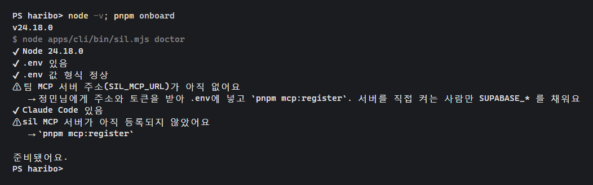

### 1-2. 전체 검사 (`pnpm check`)

타입 검사(패키지 5개), 린트, 포맷, 단위 테스트를 차례로 돌려요.

- 테스트는 10개 파일, 75개가 통과했어요.
- 가운데 `warn [mcp] ... 실패` 두 줄은 테스트가 일부러 실패 상황을 만들 때 남는 로그예요. 오류가 아니에요.

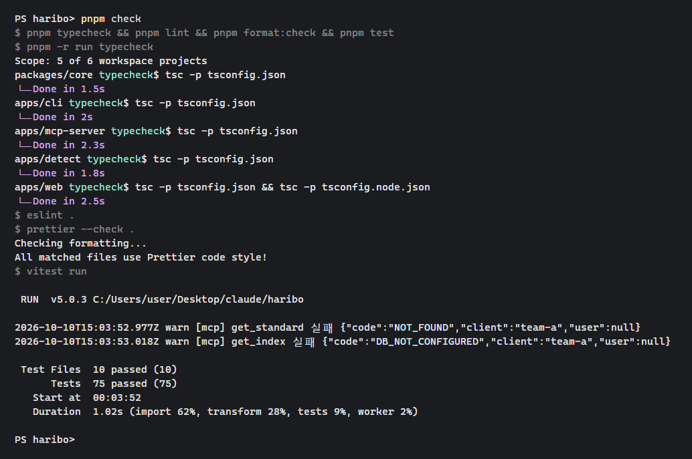

### 1-3. 단위 테스트 75개 이름

어떤 동작을 검사하는지 이름까지 보이게 돌린 화면이에요 (`--reporter=verbose`).

펼쳐 보기 (긴 화면)

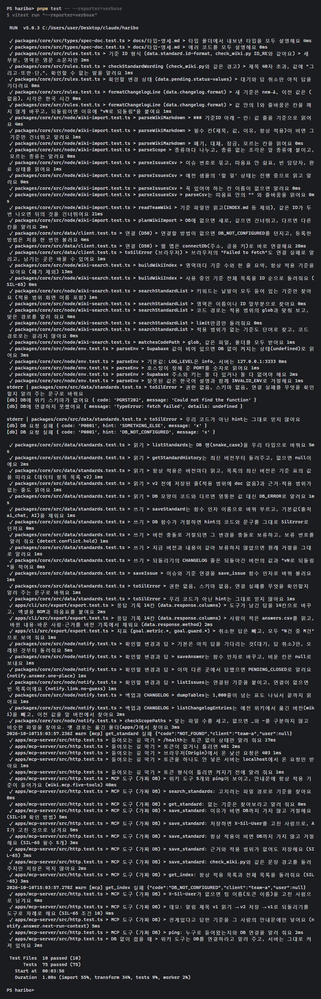

## 2. MCP 서버

### 2-1. 점검 (`pnpm mcp:check`)

서버를 HTTP로 켜고 Claude Code 없이 붙어 봐요.

- 토큰 없는 요청은 401로 거절돼요.
- 도구 6개(ping과 위키 도구 5개)가 보여요.
- ping에 답해요.

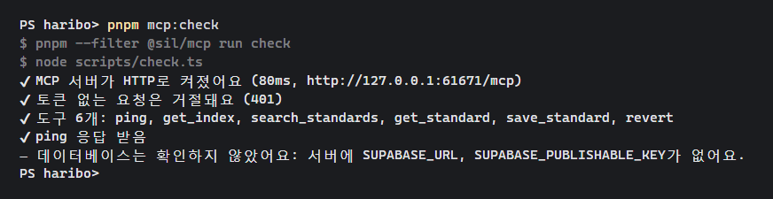

### 2-2. 서버 켜기 (`pnpm mcp:serve`)

팀 서버를 켜는 명령이에요. 이 PC에는 DB 주소와 팀 토큰이 없어서 두 가지 표시가 나와요.

- "DB 없음"(`dataMode: none`)
- "localhost에서 온 요청만 받아요"

호스팅에 올릴 때는 이 두 값(DB 주소, 팀 토큰)을 채워요.

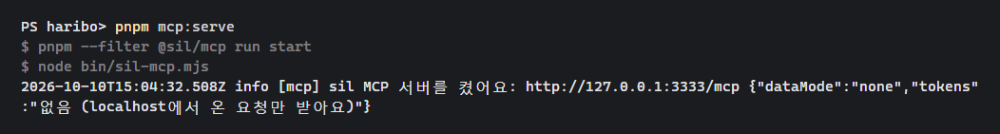

## 3. 팀 위키 불러오기와 적용 범위

### 3-1. 불러오기 미리 보기 (`pnpm sil import`)

팀 저장소에 올렸을 때와 같은 자리(`team-wiki/`, `samples/`)에서 읽었어요. 기준 90개와 이슈 14개를 읽었어요. 기본은 미리 보기라서 DB에는 넣지 않아요 (넣으려면 `--apply`).

경고는 샘플 데이터 문제예요.

- v2에 없는 '할 일' 상태가 있어요.
- 위키에 없는 기준(`notify.answer.skip-limit`)에 연결된 이슈가 있어요.

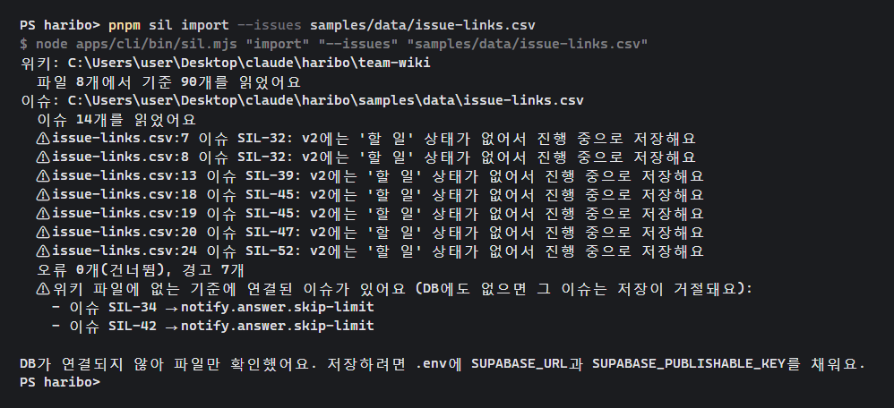

### 3-2. 적용 범위 경로 확인 (`pnpm sil scope-check`)

위키의 코드 경로 32개 중 4개만 실제 파일과 맞아요. 위키가 아직 폴더를 옮기기 전 경로(`packages/mcp/` 등)를 쓰기 때문이에요. 옛 경로마다 새 폴더(`apps/...`)에서 찾은 비슷한 파일을 후보로 보여 줘요.

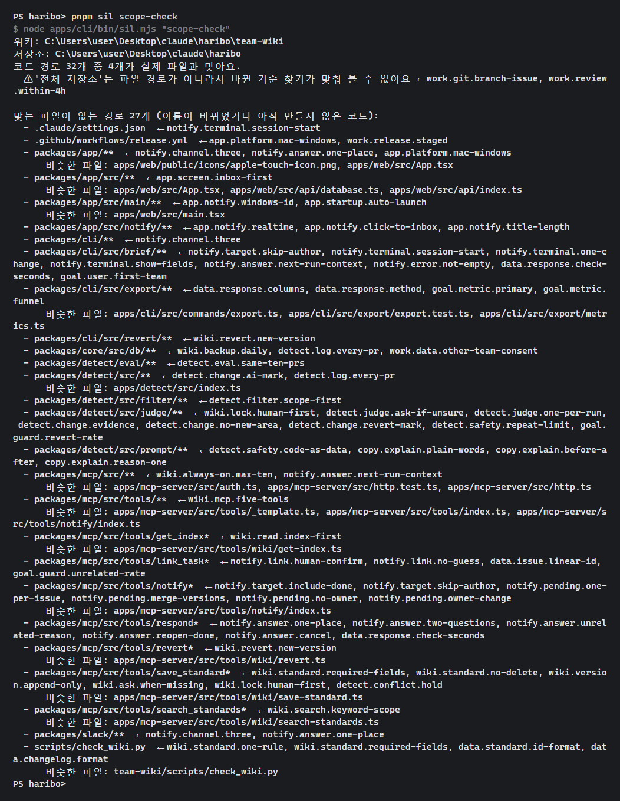

## 4. DB 규칙 (SQL 검사)

임시 PostgreSQL에 마이그레이션 4개를 올린 빈 DB에 검사 파일을 넣었어요. 검사는 모두 ROLLBACK이라 데이터가 남지 않아요.

- 화면의 `sqltest <파일>`은 `psql`로 검사 파일을 돌리는 짧은 함수예요.
- `psql`이 콘솔에 바로 쓰면 한글이 깨져서, 출력을 PowerShell로 받아 보여 줘요.

| 검사 파일                        | 개수 | 확인하는 것                                                      |
| -------------------------------- | ---- | ---------------------------------------------------------------- |
| `wiki.test.sql`                  | 41   | 필수 칸, 버전 충돌, 지우기·고치기 금지, 되돌리기, 항상 적용 10개 |
| `v2.test.sql`                    | 49   | 데이터 항목 목록 v2 표, 이슈 저장, 데모 순서                     |
| `compat.test.sql`                | 51   | 팀 위키 호환, 충돌 보류, 답 저장·취소, AI 안전 규칙              |
| `always_on_per_version.test.sql` | 15   | 항상 적용을 버전마다 남기고 되돌리기                             |

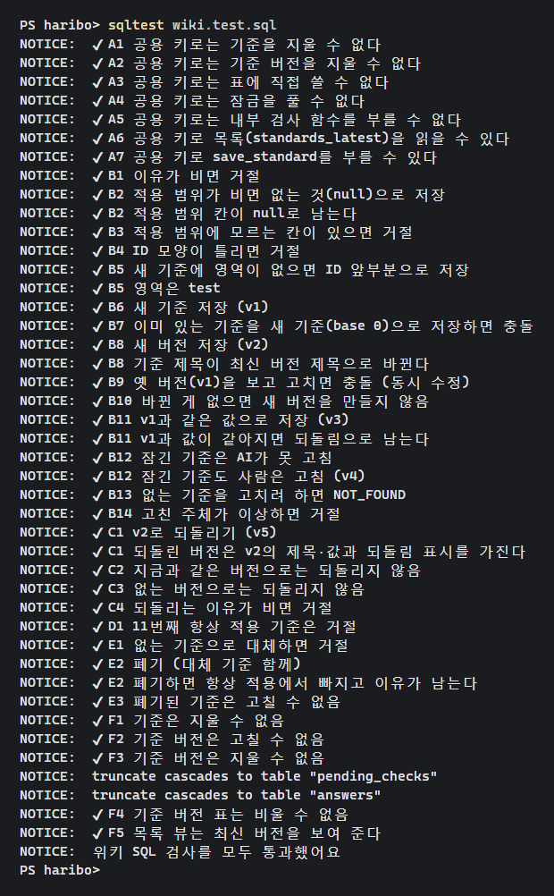

나머지 세 파일 펼쳐 보기

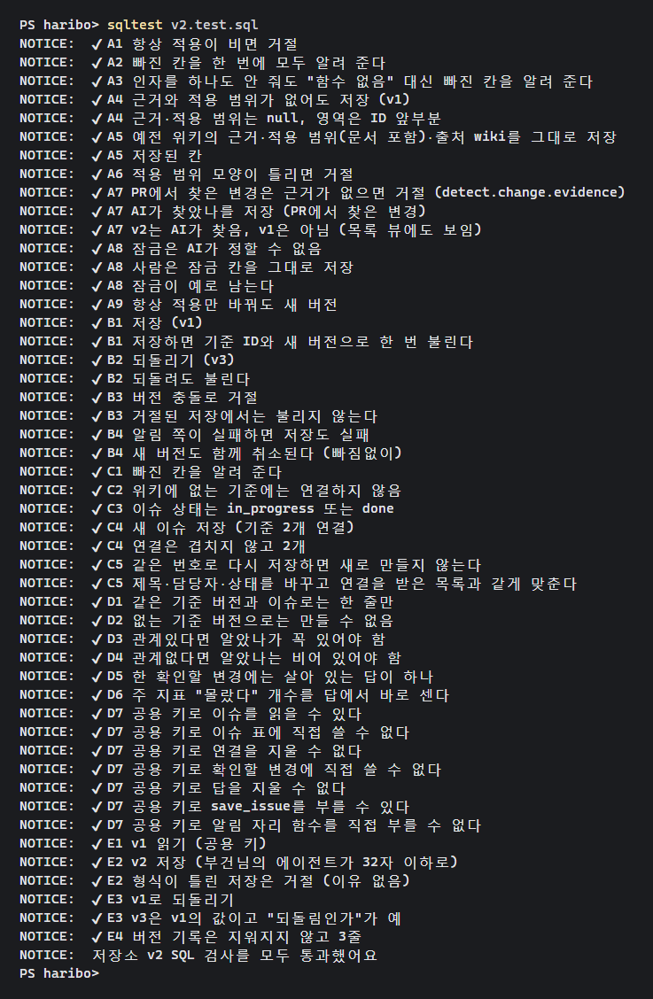

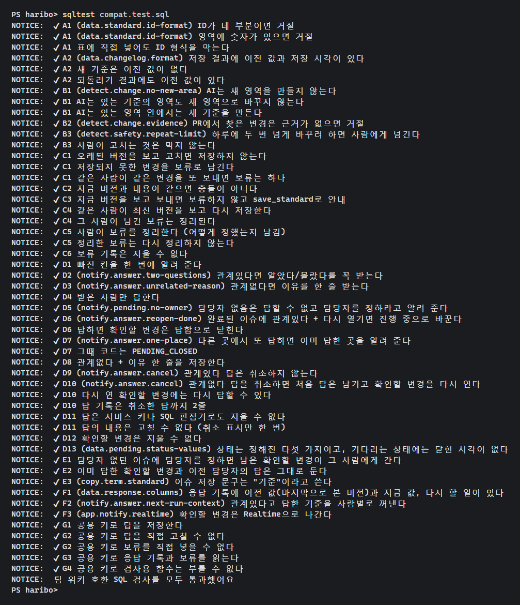

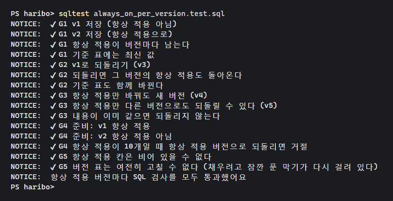

## 5. 웹 앱 빌드와 바뀐 기준 찾기

웹 앱 빌드는 몇 초 안에 끝나요. 바뀐 기준 찾기(`detect`)는 아직 뼈대라서 실행되는 것만 확인했어요 (경하님 SIL-66).

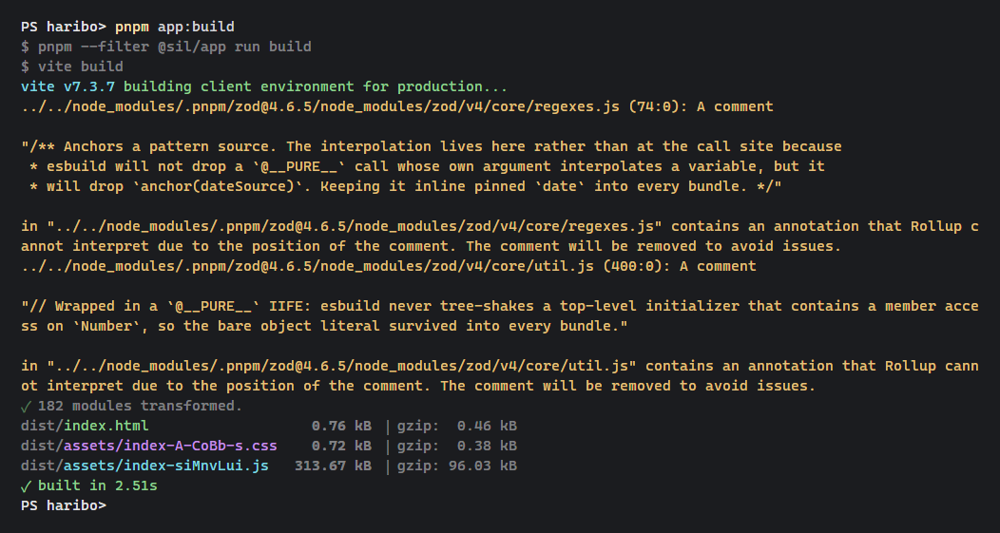

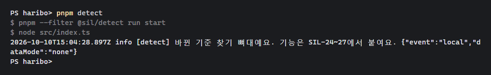

## 6. Claude Code에서 쓰기 · 부건님 세션

**시험 방법**

- 팀원 작업 폴더처럼 만든 곳에서 Claude Code를 켰어요. `.mcp.json`에는 MCP 서버 주소와 사람 이름 "부건"(`X-Sil-User`)이 들어 있어요.
- MCP 서버는 haribo의 서버 코드(`apps/mcp-server/src/http.ts`)를 Node 24.18로 켠 로컬 서버예요. 임시 PostgreSQL에 공용 키와 같은 권한(anon)으로 붙어요.
- 이 Claude Code 버전은 **auto mode**가 기본이에요. 그래서 도구를 쓸 때 사람에게 묻지 않고, 판단기(classifier)가 허락하면 바로 실행해요. 묻는 화면은 7절(정민님 세션)에서 보여 드려요.

### 6-1. 시작 화면

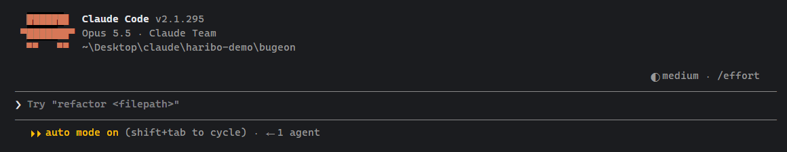

### 6-2. MCP 서버 연결 확인 (`/mcp`)

`sil` 서버가 연결돼 있어요(✔ connected, authenticated, 도구 6개). 도구 목록 중 읽기 도구 4개에는 "read-only" 표시가 붙어요. 저장(`save_standard`)과 되돌리기(`revert`)에는 붙지 않아요.

| 서버 목록                                        | 서버 정보                                           | 도구 목록                                          |
| ------------------------------------------------ | --------------------------------------------------- | -------------------------------------------------- |
| 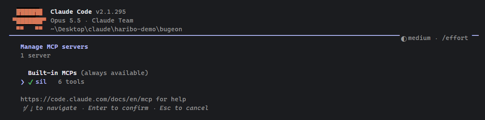 | 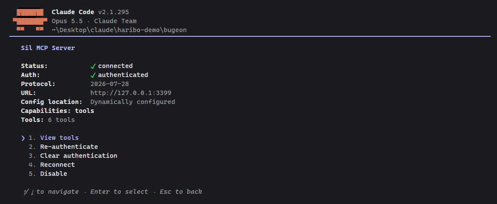 | 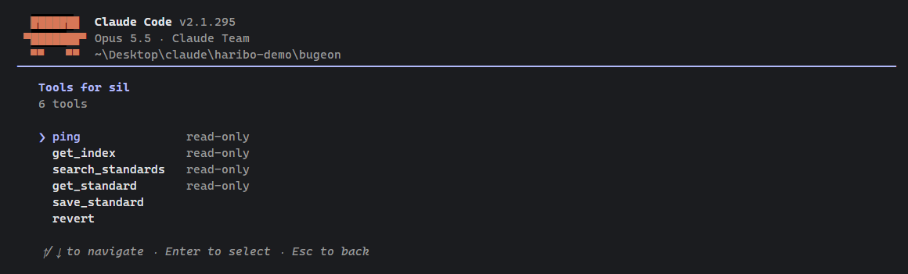 |

### 6-3. 세션 시작 때 받은 항상 적용 기준

도구를 부르지 말라고 했는데도 항상 적용 기준 9개를 그대로 알아요. 서버가 연결할 때 안내문(instructions)으로 넘겨줬기 때문이에요 (SIL-65 조건 8).

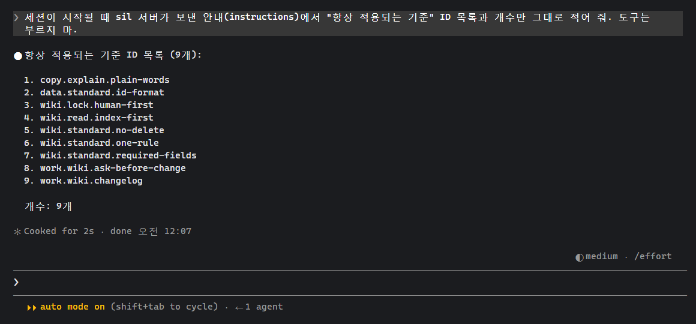

### 6-4. 찾기와 읽기

"알림 제목 길이 기준을 찾아 줘"라고 하자 `sil`을 세 번 부르고 지금 버전(v1), 값, 이유를 알려 줘요. 기본 화면에서는 도구 호출이 "Called sil 3 times" 한 줄로 접혀요. Ctrl+O로 펼치면 서버가 돌려준 내용이 그대로 보여요.

펼친 화면 아래쪽 "Allowed by auto mode classifier"는 auto mode가 이 도구 사용을 허락했다는 표시예요.

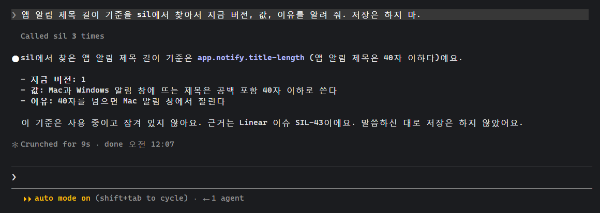

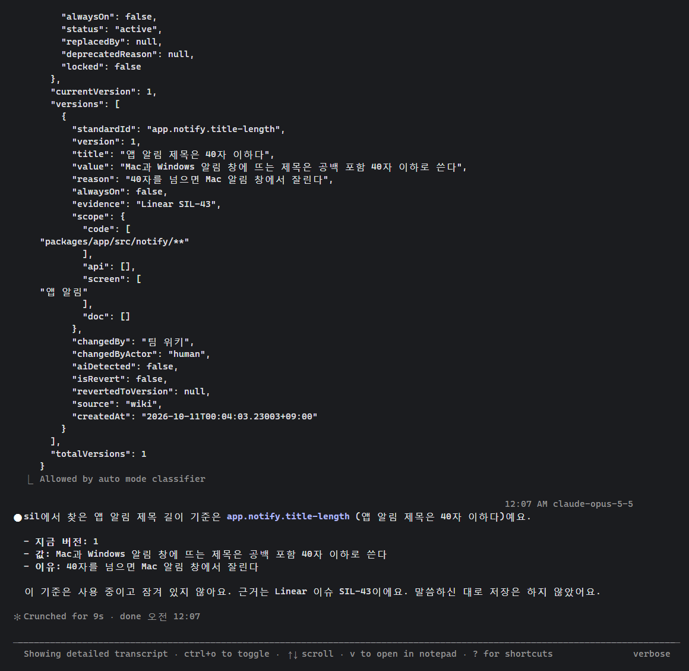

### 6-5. v2 저장

32자 기준을 새 버전으로 저장했어요. 저장한 사람은 "부건"으로 남고, CHANGELOG에 붙일 한 줄도 함께 와요 (SIL-65 조건 6·10).

Claude가 먼저 짚은 것이 두 가지 있어요 ([9절](#9-피드백-받고-싶은-점) 3·5번).

- 근거가 예전 40자 기준의 근거(Linear SIL-43) 그대로예요.
- 작업 폴더에 `team-wiki/CHANGELOG.md`가 없어서 그 한 줄을 붙이지 않았어요.

맨 아래 입력칸의 흐린 글씨("v1으로 되돌려 줘")는 Claude Code가 다음 말을 제안하는 기능이에요. 시험에서 입력한 것이 아니에요.

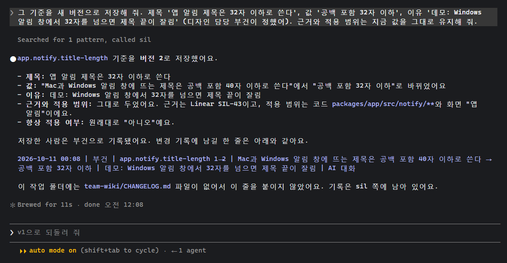

### 6-6. 이유를 비우고 저장하면 거절

이유를 빈 문자열로 저장하게 하자 MCP 서버가 "이유(reason)이(가) 비어 있어요. 지어내지 말고 사람에게 물어본 뒤 다시 저장해 주세요"로 거절했어요. 새 버전은 생기지 않았어요 (SIL-65 조건 6). 같은 검사는 DB 함수에도 있어요 (4절 `wiki.test.sql`).

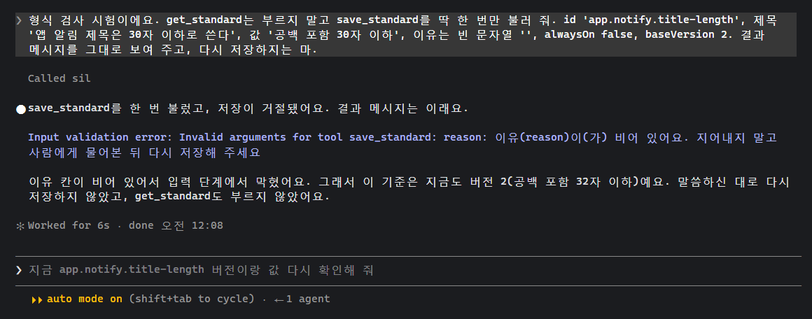

Ctrl+O로 펼친 기록

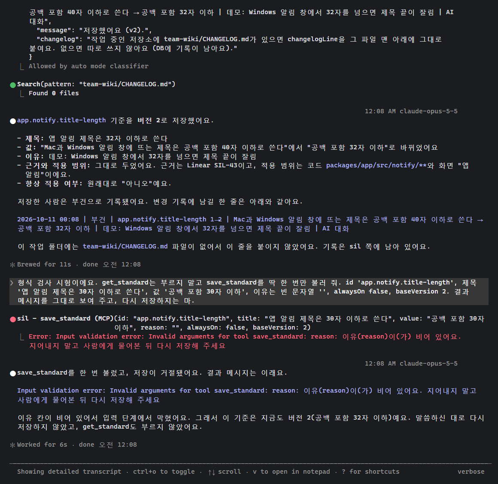

## 7. Claude Code에서 되돌리기 · 정민님 세션

이번에는 Claude Code를 **기본 권한 모드**(`--permission-mode default`)로 켰어요. 도구를 쓰기 전마다 Claude Code가 사람에게 물어요. 화면 아래에는 "manual mode on"으로 보여요. 사람 이름은 "정민"이에요.

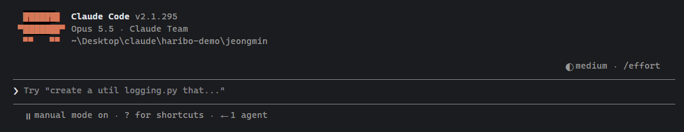

### 7-1. 권한 확인 창

"v1으로 되돌려 줘"라고 하자 권한 확인 창이 세 번 떴어요. 모두 1번(Yes)을 골랐어요.

1. **기준 읽기(`get_standard`):** 지금 버전을 확인해요.
2. **되돌리기(`revert`):** 넘길 값(대상 버전 1, 지금 버전 2, 이유)과 도구 설명이 보여요.
3. **기준 읽기(`get_standard`):** 되돌린 뒤 기록을 다시 읽어요.

창에 나오는 도구 이름은 "sil — Revert Tool"처럼 영어로 보여요 ([9절](#9-피드백-받고-싶은-점) 1번).

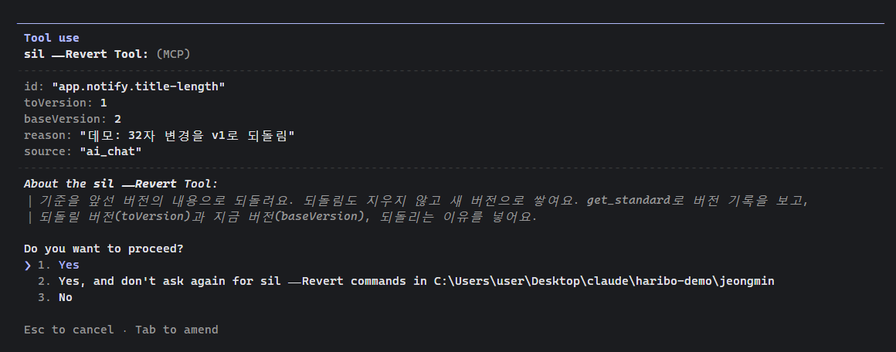

읽기 도구 권한 창 두 개

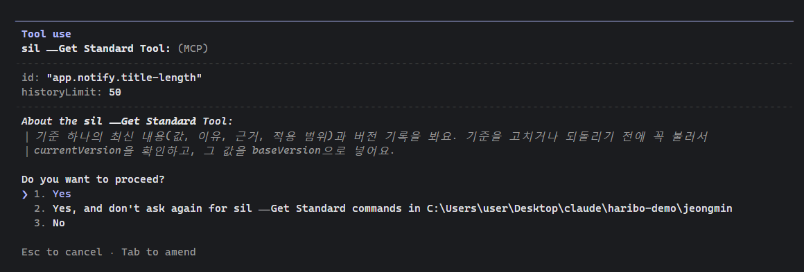

### 7-2. 되돌린 결과

v1 값을 가진 v3이 새로 생겼어요. 지운 기록은 없어요. 표에는 v3(정민, 되돌림 예), v2(부건), v1(팀 위키)이 보여요 (SIL-65 조건 7·10).

Claude가 짚은 것이 하나 있어요. 되돌릴 때 근거 칸이 "v1로 되돌림"으로 자동으로 채워져서 SIL-43이 빠졌어요 ([9절](#9-피드백-받고-싶은-점) 4번).

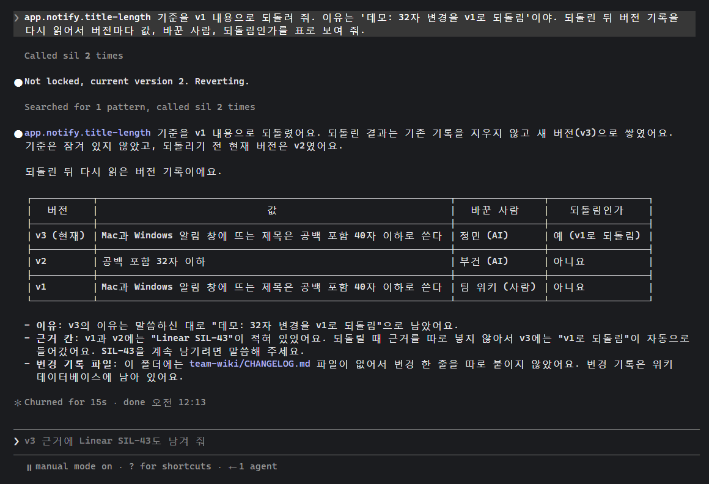

Ctrl+O로 펼쳐 위로 올린 화면이에요. 서버가 돌려준 버전 기록에 v3의 `isRevert: true`, `revertedToVersion: 1`, `changedBy: "정민"`이 보여요.

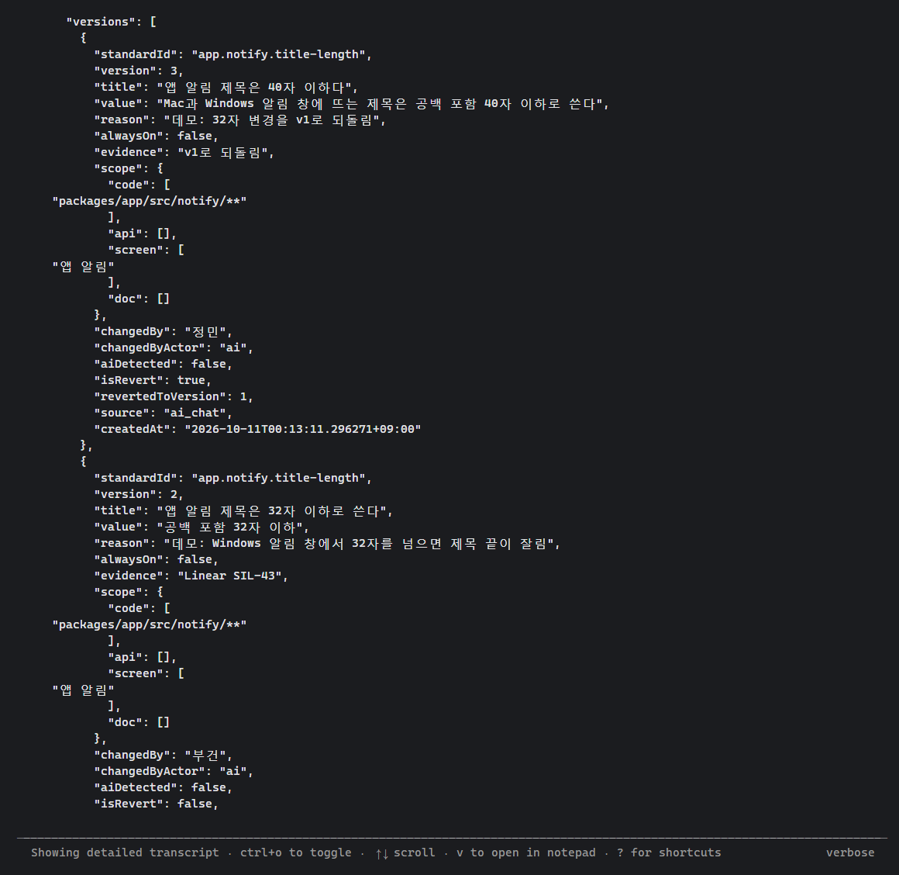

### 7-3. DB에 남은 기록

세션이 끝난 뒤 DB를 직접 보면 v1(팀 위키, 사람) → v2(부건, AI) → v3(정민, AI, v1로 되돌림)이 그대로 남아 있어요.

확인할 변경(`pending_checks`)이 0건인 것은 "새 버전을 알리는 방법"(SIL-65 조건 9)을 아직 정하지 않아서예요.

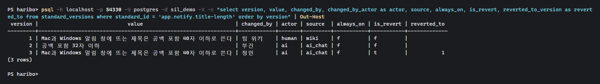

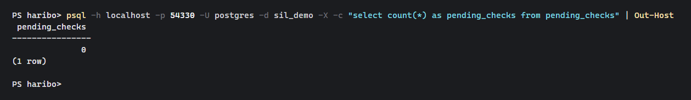

## 8. 웹 앱 (PWA)

`pnpm app:build`로 만든 배포본을 `pnpm app:preview`(http://localhost:4173)로 열었어요.

### 8-1. 첫 화면과 설치 버튼

Supabase 주소·키가 없어서 예시 데이터로 열렸고, 메뉴 아래에 그렇게 알려 줘요. 브라우저가 설치할 수 있다고 알려 주면 **"앱으로 설치"** 버튼이 떠요.

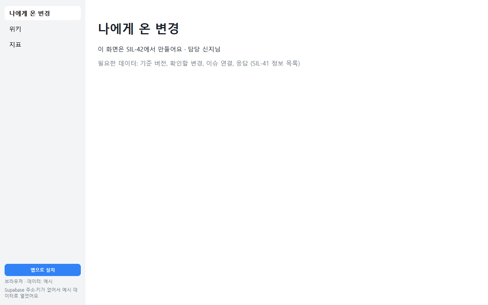

### 8-2. 메뉴 이동

화면 세 칸은 아직 자리만 있어요 (신지님 SIL-42·44·45).

| 위키                                          | 지표                                             |
| --------------------------------------------- | ------------------------------------------------ |
| 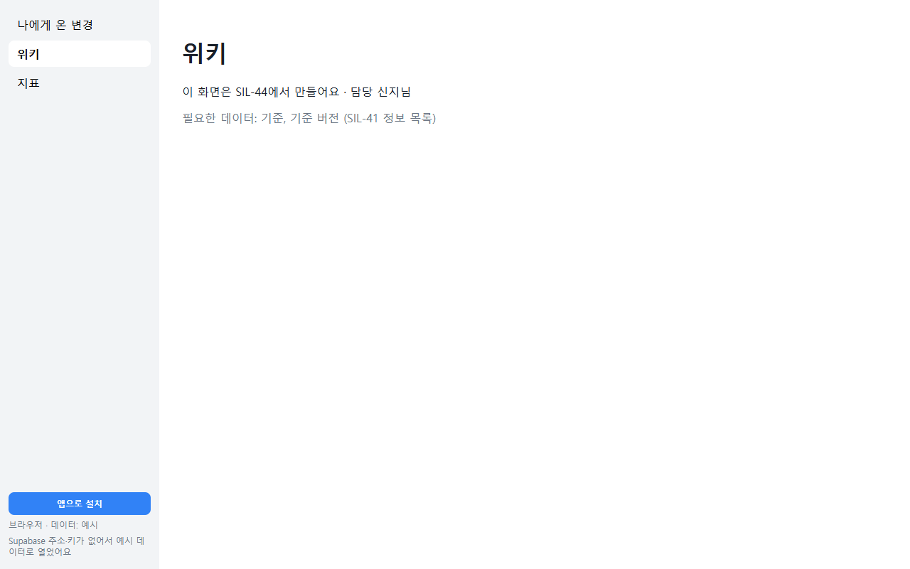 | 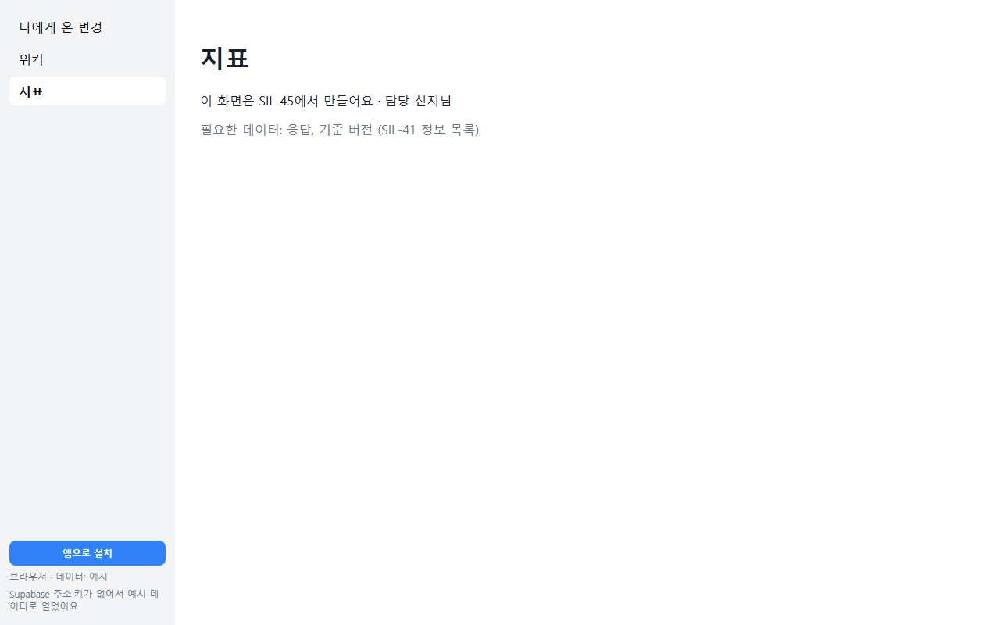 |

### 8-3. 설치 정보와 서비스 워커

- **매니페스트:** 이름 HARIBO, 앱 창으로 열기(`standalone`), 아이콘 3개가 들어 있어요.
- **서비스 워커:** Edge의 서비스 워커 페이지에서 `http://localhost:4173/`가 "ACTIVATED, RUNNING"이고, 요청을 다루는 부분(fetch handler)이 있어요.
- **Edge 판정:** 개발자 도구 기능(DevTools Protocol)으로 물었더니 설치를 막는 문제 0개, 매니페스트 오류 0개였어요 (SIL-65 조건 11의 "PWA로 설치").

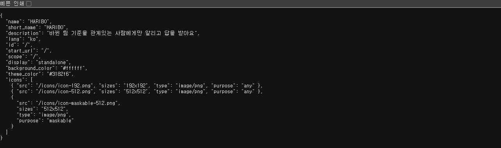

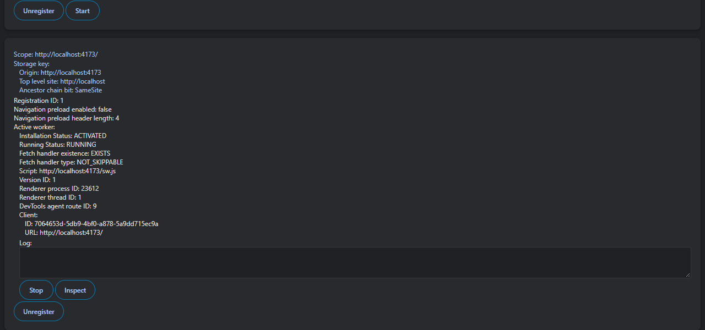

### 8-4. 서버가 꺼졌을 때

배포본 서버를 끄고 새로 고쳤어요. 서버로 가는 요청은 실패했지만(`Failed to fetch`), 서비스 워커가 저장해 둔 앱 껍데기로 화면이 열렸어요.

### 8-5. DB에 붙었을 때

**왜 시험 서버를 썼나요:** 아직 Supabase 프로젝트가 없어요. 그래서 Supabase(PostgREST)처럼 `standards` 개수만 돌려주는 작은 시험 서버를 띄우고, 그 주소와 시험용 공용 키로 빌드했어요.

화면이 브라우저에서 공용 키를 붙여 직접 물었고, "데이터: DB (기준 90개)"가 나왔어요. 시험 서버도 공용 키가 붙은 요청(`HEAD /rest/v1/standards?select=id`)을 받았어요.

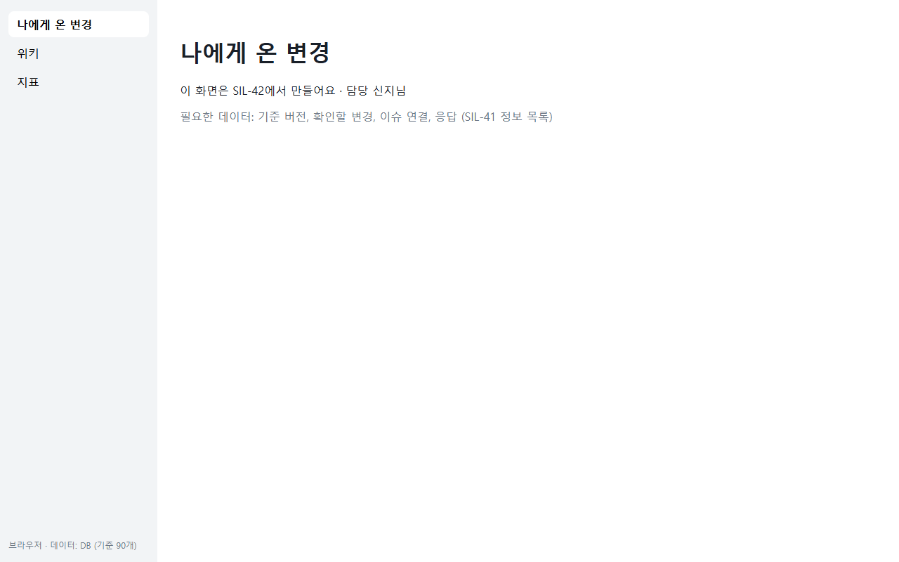

### 8-6. DB에 못 붙었을 때

시험 서버를 끄고 새로 고쳤어요.

| 1초 뒤                                                       | 약 15초 뒤                                              |
| ------------------------------------------------------------ | ------------------------------------------------------- |
|  |  |

실패를 빈 목록이나 "변경 없음"으로 숨기지 않고, 무엇을 확인할지 빨간 글씨로 알려 줘요 (notify.error.not-empty).

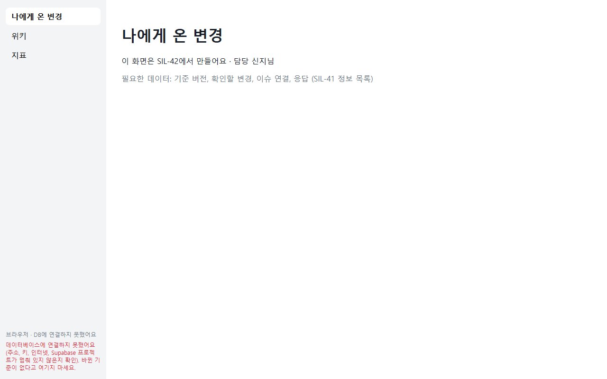

## 9. 피드백 받고 싶은 점

| #   | 질문                                                                                                                                                                 | 관련 그림  | 특히 봐 주실 분 |
| --- | -------------------------------------------------------------------------------------------------------------------------------------------------------------------- | ---------- | --------------- |
| 1   | 권한 확인 창과 `/mcp` 화면에 도구 이름이 "sil — Revert Tool", "Get Standard Tool"처럼 영어로 보여요. 팀원이 보기에 괜찮을까요, 한국어 이름을 찾아볼까요?             | 23, 31~33  | 부건님          |
| 2   | auto mode에서는 저장(`save_standard`)도 묻지 않고 실행돼요. 저장과 되돌리기만은 꼭 사람에게 묻게 할까요? (예: 팀 설정에서 두 도구만 "묻기")                          | 26, 27, 32 | 경하님, 정민님  |
| 3   | 새 버전을 저장할 때 근거가 옛 값 그대로 남아요. 값을 바꿀 때 근거도 새로 받게 할까요? (wiki.standard.required-fields, detect.change.evidence)                        | 27         | 호윤님          |
| 4   | 되돌리면 근거가 "v1로 되돌림"으로 바뀌어 원래 근거(SIL-43)가 빠져요. 되돌린 버전의 근거를 이어받는 게 나을까요?                                                      | 34, 35     | 호윤님, 정민님  |
| 5   | 저장 결과에 CHANGELOG 한 줄이 오지만, 작업 폴더에 `team-wiki/CHANGELOG.md`가 없으면 붙이지 않아요. DB로 옮긴 뒤에도 CHANGELOG.md를 계속 쓸까요? (설계 지침서 11절 6) | 27, 34     | 호윤님          |
| 6   | 위키 적용 범위가 옛 경로(`packages/app/src/notify/**` 등)라서 32개 중 4개만 맞아요. `scope-check`가 알려 주는 새 경로로 고쳐 주실 수 있을까요? (SIL-62)              | 07, 27     | 경하님          |
| 7   | 확인할 변경이 0건이에요. 새 버전을 알리는 방법(SIL-65 조건 9)을 정해야 알림이 생기기 시작해요.                                                                       | 37         | 민수님          |
| 8   | DB에 못 붙었을 때 실패 문구가 뜨기까지 약 15초 걸려요. 시간 제한을 짧게(예: 5초) 둘까요?                                                                             | 47, 48     | 신지님          |
| 9   | 웹 앱 문구("앱으로 설치", "Supabase 주소·키가 없어서 예시 데이터로 열었어요", 연결 실패 문구)가 괜찮은지 봐 주세요.                                                  | 40, 45, 48 | 부건님          |
| 10  | 설치 이름을 HARIBO로 했어요. 위키 기준 copy.term.this-tool은 서비스 이름을 정하기 전에는 "이 도구"라고 부르게 해요. 이름을 무엇으로 할까요?                          | 43         | 부건님, 호윤님  |

## 10. 이 문서가 보여 주지 못한 것

- **실제 Supabase가 아니에요.**
  - Claude Code 세션은 이 PC의 임시 PostgreSQL에 공용 키와 같은 권한으로 붙였어요.
  - 웹 앱의 DB 연결은 PostgREST처럼 응답하는 시험 서버로 확인했어요.
  - supabase-js ↔ Supabase 실제 호출은 프로젝트를 만든 뒤 다시 확인해야 해요.
- **배포 주소가 없어요.** 웹 앱과 MCP 서버를 올릴 곳을 아직 정하지 않았어요. PWA 설치는 `localhost`에서 확인했고, 실제로는 HTTPS 주소가 필요해요. "앱으로 설치"를 눌러 실제로 설치한 화면은 브라우저 바깥 창이라 찍지 못했어요.
- **아직 만들지 않은 기능은 찍을 수 없었어요.** 확인할 변경 만들기(조건 9), 터미널 알림(`sil brief`), 앱 알림, 화면 세 칸이 그래요.
- **팀원 PC 등록은 하지 않았어요.** 팀원 PC에서 하는 `pnpm mcp:register`는 이 PC의 Claude Code 설정을 바꾸는 일이라 돌리지 않았어요. 대신 작업 폴더의 `.mcp.json`으로 같은 연결을 만들었어요.

관련 문서: [기능 테스트 보고서](기능-테스트.md) (10/10, 검사 결과 요약), [CLI 동작 시험](CLI-동작-시험.md) (10/9, Figma 목업과 실제 CLI 비교). 설계 지침서와 타입 명세는 코드와 함께 올릴 예정이에요.
